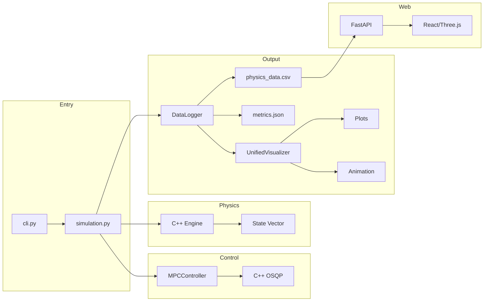

# Satellite Control System Architecture

> **Version**: 5.0.0 | **Last Updated**: January 2026

A hybrid Python/C++ Model Predictive Control (MPC) simulation system for 3D satellite maneuvers with PWM thrusters and reaction wheels.

---

## Quick Reference

```
make sim        # Run simulation (generates plots, CSV, JSON, MP4)
make backend    # Start FastAPI server (port 8000)
make frontend   # Start web interface (Vite dev server)
```

---

## Directory Structure

```
Satellite_3D_PWM-Continuous_Thrusters_ReactionWheel/
├── src/satellite_control/    # Main Python package
│   ├── cli.py               # Entry point (single 'run' command)
│   ├── core/                # Simulation engine (14 files)
│   ├── control/             # MPC controller (3 files)
│   ├── cpp/                 # C++ backend (18 files)
│   ├── config/              # Configuration system (17 files)
│   ├── mission/             # Mission management (16 files)
│   ├── physics/             # Orbital dynamics (2 files)
│   ├── planning/            # Path planning (2 files)
│   ├── visualization/       # Plotting & video (9 files)
│   ├── dashboard/           # FastAPI backend (2 files)
│   ├── utils/               # Utilities (11 files)
│   ├── fleet/               # Multi-satellite (2 files)
│   └── testing/             # Monte Carlo (2 files)
├── ui/                      # React + Three.js web interface
├── config/                  # Hydra YAML configs
├── tests/                   # pytest test suite (31 files)
├── docs/                    # Documentation
├── run_simulation.py        # Simulation entry point
├── run_dashboard.py         # Dashboard entry point
└── Makefile                 # Build targets
```

---

## Core Modules

### Entry Points

| File | Purpose |
|------|---------|
| `run_simulation.py` | CLI entry → delegates to `cli.py` |
| `run_dashboard.py` | Starts FastAPI server for web 3D visualization |
| `Makefile` | Build targets: `sim`, `backend`, `frontend`, `install` |

### src/satellite_control/cli.py (270 lines)

Single command CLI using Typer:

```python
@app.command()
def run(
    auto: bool,          # Auto mode with defaults
    duration: float,     # Max simulation time
    no_anim: bool,       # Headless mode
    classic: bool,       # Text-based menu
    engine: str,         # 'cpp'
    mission_file: str,   # Mission JSON path
): ...
```

---

## src/satellite_control/core/ (14 files)

The simulation engine with modular components:

| File | Lines | Description |
|------|-------|-------------|
| `simulation.py` | 1115 | `SatelliteMPCLinearizedSimulation` - main orchestrator |
| `simulation_loop.py` | 675 | `SimulationLoop` - animation/batch execution |
| `simulation_initialization.py` | 520 | `SimulationInitializer` - setup logic |
| `cpp_satellite.py` | 210 | `CppSatelliteSimulator` - C++ physics backend |
| `thruster_manager.py` | 340 | Valve delays, PWM modulation |
| `performance_monitor.py` | 290 | Timing statistics, metrics |
| `simulation_logger.py` | 280 | CSV/JSON data logging |
| `simulation_io.py` | 220 | File I/O operations |
| `mpc_runner.py` | 170 | MPC computation wrapper |
| `simulation_runner.py` | 90 | High-level run interface |
| `simulation_context.py` | 35 | Context manager |
| `backend.py` | 50 | Backend selection |
| `__init__.py` | - | Module exports |

### Key Class: SatelliteMPCLinearizedSimulation

```python
class SatelliteMPCLinearizedSimulation:
    """Main simulation orchestrator."""
    
    # Core Components
    satellite: CppSatelliteSimulator  # Physics backend
    mpc_controller: MPCController    # Control algorithm
    mission_state: MissionState      # Path-following state
    thruster_manager: ThrusterManager # Actuator physics
    
    # State
    state: np.ndarray[13]  # [x,y,z, qw,qx,qy,qz, vx,vy,vz, wx,wy,wz]
    target_state: np.ndarray[13]
    
    # Methods
    def run_simulation(show_animation: bool) -> None
    def get_current_state() -> np.ndarray
    def update_mpc_control() -> None
```

---

## src/satellite_control/control/ (3 files)

### mpc_controller.py (334 lines)

Python wrapper for C++ MPC backend:

```python
class MPCController(Controller):
    """C++ backend wrapper for OSQP-based MPC."""
    
    _cpp_controller: MPCControllerCpp  # C++ instance
    
    def get_control_action(
        x_current: np.ndarray,   # 13-state vector
        x_target: np.ndarray,    # 13-state target
        previous_thrusters: np.ndarray,
        x_target_trajectory: np.ndarray,  # Optional horizon
    ) -> Tuple[np.ndarray, Dict]:
        """Returns (control_vector, info_dict)."""
        
    def set_obstacles(obstacles: List[Obstacle]) -> None
    def clear_obstacles() -> None
```

### base.py (100 lines)

Abstract controller interface.

---

## src/satellite_control/cpp/ (18 files)

High-performance C++ backend with pybind11 bindings:

### Headers

| File | Description |
|------|-------------|
| `mpc_controller.hpp` | MPC class declaration |
| `linearizer.hpp` | State-space linearization |
| `obstacle.hpp` | Collision constraint types |
| `orbital_dynamics.hpp` | CW equations interface |
| `satellite_params.hpp` | Vehicle parameter struct |
| `simulation_engine.hpp` | C++ physics engine |

### Implementations

| File | Lines | Description |
|------|-------|-------------|
| `mpc_controller.cpp` | 551 | OSQP solver integration, sparse matrices |
| `linearizer.cpp` | 85 | Jacobian computation |
| `obstacle.cpp` | 110 | Linear constraint generation |
| `orbital_dynamics.cpp` | 145 | Hill-Clohessy-Wiltshire equations |
| `simulation_engine.cpp` | 240 | State propagation |

### Bindings

| File | Description |
|------|-------------|
| `bindings.cpp` | Main MPC module (`_cpp_mpc.so`) |
| `bindings_physics.cpp` | Physics module (`_cpp_physics.so`) |
| `bindings_sim.cpp` | Simulation module (`_cpp_sim.so`) |

### MPC Solver Architecture

```cpp
class MPCControllerCpp {
    // OSQP solver
    OSQPWorkspace* work_;
    SparseMatrix P_, A_;  // QP matrices
    
    // Index maps for fast updates
    std::vector<std::vector<int>> A_idx_map_;  // Quaternion dynamics
    std::vector<std::vector<int>> B_idx_map_;  // Actuator mapping
    std::vector<std::vector<int>> obs_A_indices_;  // Obstacles
    
    // Key methods
    void update_dynamics(const VectorXd& x_current);
    void update_cost(const VectorXd& x_target);
    void update_obstacle_constraints(...);
    ControlResult get_control_action(...);
};
```

---

## src/satellite_control/config/ (17 files)

Pydantic-based configuration with comprehensive validation:

| File | Lines | Description |
|------|-------|-------------|
| `models.py` | 503 | `AppConfig`, `MPCParams`, `SatellitePhysicalParams` |
| `simulation_config.py` | 350 | `SimulationConfig` - top-level config |
| `mission_state.py` | 550 | `MissionState` - runtime mission data |
| `validator.py` | 280 | Cross-field validation |
| `io.py` | 380 | YAML/JSON serialization |
| `presets.py` | 240 | FAST, BALANCED, STABLE, PRECISION presets |
| `physics.py` | 240 | Physics parameter defaults |
| `constants.py` | 170 | System-wide constants |
| `adapter.py` | 210 | Hydra ↔ Pydantic conversion |
| `orbital_config.py` | 110 | Orbital parameters |
| `actuator_config.py` | 150 | Thruster/RW configuration |
| `reaction_wheel_config.py` | 150 | Reaction wheel parameters |
| `thruster_config.py` | 75 | Thruster parameters |
| `timing.py` | 135 | Timing constants |
| `obstacles.py` | 180 | Obstacle definitions |
| `defaults.py` | 85 | Default value factories |
| `__init__.py` | - | Module exports |

### Configuration Hierarchy

```
AppConfig
├── physics: SatellitePhysicalParams
│   ├── total_mass, moment_of_inertia, satellite_size
│   ├── thruster_positions/directions/forces (Dict[int, Tuple])
│   └── damping, noise, delays
├── mpc: MPCParams
│   ├── prediction_horizon, control_horizon, dt
│   ├── Q weights (position, velocity, angle, angular_velocity)
│   ├── R weights (thrust, rw_torque)
│   └── collision_avoidance settings
└── simulation: SimulationParams
    ├── dt, max_duration, headless
    └── timing parameters
```

---

## src/satellite_control/mission/ (11 files)

Mission configuration and execution:

| File | Lines | Description |
|------|-------|-------------|
| `interactive_cli.py` | 1230 | Rich-based interactive menus |
| `mission_report_generator.py` | 900 | PDF/HTML report generation |
| `trajectory_utils.py` | 195 | Spline trajectory generation |
| `mesh_scan.py` | 210 | 3D object scanning missions |
| `mission_types.py` | 165 | Mission, Waypoint, Phase dataclasses |
| `mission_factory.py` | 155 | Mission creation helpers |
| `path_following.py` | 110 | DXF/shape following |
| `starlink_orbit.py` | 180 | Starlink inspection path generation |
| `mission_logic.py` | 220 | Path/shape generation helpers |
| `__init__.py` | - | Module exports |

---

## src/satellite_control/physics/ (2 files)

### orbital_dynamics.py (213 lines)

Hill-Clohessy-Wiltshire (CW) relative motion dynamics:

```python
@dataclass
class CWDynamics:
    """Computes gravity gradient accelerations for LEO."""
    
    orbital_config: OrbitalConfig
    _cpp_backend: Optional[CppCWDynamics]  # C++ acceleration
    
    def compute_acceleration(position, velocity) -> np.ndarray:
        """CW equations: ẍ = 3n²x + 2nẏ, ÿ = -2nẋ, z̈ = -n²z"""
        
    def get_state_matrices(dt) -> Tuple[np.ndarray, np.ndarray]:
        """Discrete-time A, B matrices."""
```

---

## src/satellite_control/planning/ (2 files)

### rrt_star.py (274 lines)

RRT* path planner for obstacle avoidance:

```python
class RRTStarPlanner:
    """Rapidly-exploring Random Tree Star."""
    
    def plan(
        start: np.ndarray,      # [x, y, z]
        goal: np.ndarray,       # [x, y, z]
        obstacles: List[Obstacle]
    ) -> List[np.ndarray]:
        """Returns collision-free waypoint list."""
```

### trajectory_generator.py (45 lines)

Converts waypoints to time-parameterized trajectories.

---

## src/satellite_control/visualization/ (9 files)

| File | Lines | Description |
|------|-------|-------------|
| `unified_visualizer.py` | 3050 | Post-processor, generates all plots & videos |
| `plot_generator.py` | 2500 | 16+ plot types (position, velocity, thrusters) |
| `dashboard.py` | 1340 | Deprecated matplotlib dashboard |
| `video_renderer.py` | 810 | FFmpeg-based MP4 generation |
| `simulation_visualization.py` | 920 | 3D trajectory animation |
| `satellite_2d_diagram.py` | 310 | Thruster layout diagram |
| `shape_utils.py` | 160 | DXF parsing utilities |
| `__init__.py` | - | Module exports |

### Post-Processing Pipeline

```
simulation.py
    └── SimulationLoop.run()
        └── _save_data()
            └── UnifiedVisualizationGenerator.generate_all()
                ├── plot_generator.py → 16 PNG plots
                └── video_renderer.py → animation.mp4
```

---

## src/satellite_control/dashboard/ (2 files)

### app.py (630 lines)

FastAPI backend for web 3D visualization:

```python
app = FastAPI()

@app.get("/api/simulations")
def list_simulations() -> List[SimulationInfo]

@app.get("/api/simulation/{sim_id}/data")
def get_simulation_data(sim_id: str) -> SimulationData

@app.websocket("/ws/live")
async def websocket_live(websocket: WebSocket)
```

---

## src/satellite_control/utils/ (11 files)

| File | Lines | Description |
|------|-------|-------------|
| `simulation_state_validator.py` | 600 | State validation, noise injection |
| `data_logger.py` | 490 | High-frequency CSV logging |
| `profiler.py` | 295 | Performance profiling decorators |
| `spline_path.py` | 190 | Cubic spline interpolation |
| `logging_config.py` | 180 | Logging setup |
| `navigation_utils.py` | 165 | Angle normalization, distance |
| `caching.py` | 160 | LRU caching decorators |
| `state_converter.py` | 100 | State vector conversion |
| `orientation_utils.py` | 60 | Quaternion ↔ Euler conversion |
| `__init__.py` | - | Module exports |

---

## src/satellite_control/fleet/ (2 files)

### fleet_manager.py (220 lines)

Multi-satellite coordination (experimental):

```python
class FleetManager:
    """Manages multiple satellite instances."""
    satellites: Dict[str, SatelliteHandle]
    
    def add_satellite(name: str, config: AppConfig) -> None
    def step_all(dt: float) -> None
```

---

## src/satellite_control/testing/ (2 files)

### monte_carlo.py (470 lines)

Statistical validation framework:

```python
class MonteCarloRunner:
    """Run N simulations with parameter variations."""
    
    def run(
        n_trials: int,
        parameter_ranges: Dict[str, Tuple[float, float]],
    ) -> MonteCarloResults
```

---

## Configuration Files

### config/ (Hydra YAML)

```
config/
├── main.yaml              # Root config
├── control/
│   └── mpc/
│       └── default.yaml   # MPC parameters
├── vehicle/
│   ├── cube_sat_6u.yaml   # 6U CubeSat config
│   └── test_3_thruster.yaml
└── missions/
    ├── maze.yaml
    ├── flyby_demo.json
    └── obstacle_demo.json
```

## Test Suite

### tests/ (31 test files)

| Category | Files |
|----------|-------|
| **Unit Tests** | `test_config.py`, `test_caching.py`, `test_navigation_utils.py`, `test_orientation_utils.py`, `test_shape_utils.py`, `test_state_converter.py` |
| **Component Tests** | `test_mpc_controller.py`, `test_thruster_manager.py`, `test_simulation_loop.py`, `test_simulation_logger.py`, `test_simulation_io.py`, `test_simulation_initialization.py`, `test_simulation_context.py`, `test_simulation_state_validator.py`, `test_data_logger.py`, `test_performance_monitor.py`, `test_video_renderer.py`, `test_plot_generator.py`, `test_spline_path.py` |
| **Mission Tests** | `test_mission_state_refactor.py`, `test_presets.py` |
| **Integration Tests** | `test_integration_basic.py`, `test_integration_missions.py`, `test_integration_refactored.py`, `test_factories.py` |
| **Property-Based** | `test_property_based.py` |
| **Benchmarks** | `test_benchmark.py` |
| **Subdirectories** | `benchmarks/`, `e2e/`, `integration/`, `physics/`, `planning/`, `verification/` |

---

## Web Interface (ui/)

React + TypeScript + Three.js application:

```
ui/
├── src/
│   ├── App.tsx           # Main component
│   ├── components/
│   │   ├── Viewer3D.tsx  # Three.js scene
│   │   ├── Controls.tsx  # UI controls
│   │   └── Timeline.tsx  # Playback
│   └── api/
│       └── client.ts     # FastAPI client
├── package.json
├── vite.config.ts
└── tsconfig.json
```

---

## Data Flow



---

## State Vector

13-element state used throughout the system:

| Index | Element | Units |
|-------|---------|-------|
| 0-2 | Position (x, y, z) | meters |
| 3-6 | Quaternion (w, x, y, z) | - |
| 7-9 | Velocity (vx, vy, vz) | m/s |
| 10-12 | Angular velocity (ωx, ωy, ωz) | rad/s |

---

## Build System

### CMakeLists.txt

```cmake
find_package(Eigen3 REQUIRED)
find_package(osqp REQUIRED)
find_package(pybind11 REQUIRED)

pybind11_add_module(_cpp_mpc 
    cpp/bindings.cpp
    cpp/mpc_controller.cpp
    cpp/linearizer.cpp
    cpp/obstacle.cpp
)
```

### Installation

```bash
make venv      # Create .venv311
make install   # Install dependencies + build C++
make sim       # Run simulation
```

---

## Performance Characteristics

| Metric | Value |
|--------|-------|
| MPC solve time (mean) | ~1 ms |
| MPC solve time (P95) | ~2 ms |
| Physics timestep | 0.001 s (1000 Hz) |
| Control timestep | 0.05 s (20 Hz) |
| Typical sim duration | 25-60 s |
| Real-time factor | ~170x faster |
