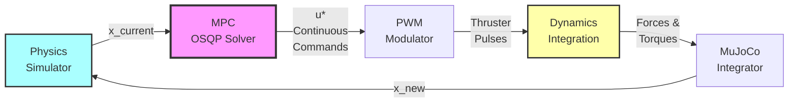

# Mathematical Documentation

> **Note:** This document provides comprehensive mathematical formulation and implementation details for the satellite control system. It covers the MPC optimization problem, dynamics linearization, thruster allocation, and navigation mathematics. For system architecture and code structure, see [ARCHITECTURE.md](ARCHITECTURE.md). For development guidelines, see [DEVELOPMENT_GUIDE.md](DEVELOPMENT_GUIDE.md).
>
> **Update:** The derivations below primarily document the legacy planar (x, y, yaw) model. The current controller uses a 13-state 3D model with planar thrusters and tilt-based Z translation. Treat the equations as planar approximations unless otherwise noted.

---

## Notation Conventions

| Notation                     | Meaning                                          | Example                                                |
| ---------------------------- | ------------------------------------------------ | ------------------------------------------------------ |
| **Bold lowercase** (𝐱, 𝐮, 𝐯) | Column vectors                                   | 𝐱 = [x, y, θ]ᵀ                                         |
| **Bold uppercase** (𝐀, 𝐁, 𝐑) | Matrices                                         | 𝐀 ∈ ℝ⁶ˣ⁶                                               |
| Subscript k                  | Time step index                                  | x_k (state at time k)                                  |
| Superscript \*               | Optimal value                                    | u\* (optimal control)                                  |
| Hat (x̂)                      | Estimated/predicted value                        | x̂\_{k+1} (predicted state)                             |
| Δ (delta prefix)             | Deviation from nominal / discrete step           | Δx = x - x₀, Δt = timestep                             |
| ‖·‖                          | Euclidean norm                                   | ‖𝐱‖ = √(x² + y²)                                       |
| ‖·‖\_Q                       | Weighted norm                                    | ‖𝐱‖²_Q = 𝐱ᵀQ𝐱                                          |
| ∈                            | Element of set                                   | u ∈ {0,1}                                              |
| ℝ                            | Real numbers                                     | x ∈ ℝ                                                  |
| 𝒪(·)                         | Big-O notation: "scales as" or "on the order of" | Error = 𝒪(Δt²) means error grows proportionally to Δt² |

**Frame Notation:**

- Subscript "world" or "w": world/inertial frame tied to the simulation coordinate system
- Subscript "body" or "b": body-fixed frame that spins with the vehicle
- 𝐑(θ): rotation matrix from body to world frame, implemented in the dynamics linearization/integration code (`mpc_controller.py`, `mujoco_satellite.py`)

---

## Table of Contents

1. [Coordinate Systems & State Definition](#coordinate-systems--state-definition)
2. [3-DOF Rigid Body Dynamics](#3-dof-rigid-body-dynamics)
3. [Thruster Force Allocation](#thruster-force-allocation)
4. [Linearization for MPC](#linearization-for-mpc)
5. [Model Predictive Control Formulation](#model-predictive-control-formulation)
6. [Navigation Mathematics](#navigation-mathematics)
7. [Numerical Integration](#numerical-integration)
8. [Control Implementation Details](#control-implementation-details)
9. [Parameter Sensitivity & Tuning](#parameter-sensitivity--tuning)
10. [Solver Parameter Sensitivity](#solver-parameter-sensitivity)

---

## System Overview

### System Architecture

The simulation loop is designed to mimic a realistic control cycle:



**Simulation Loop Frequency:**

- **Control loop**: 16.67 Hz (60ms per cycle)
- **Physics integration**: 200 Hz (5ms per step) - MuJoCo simulation step

**Key Components:**

- **Physics Simulator**: Uses MuJoCo to simulate rigid body dynamics with high fidelity.
- **MPC Controller**: Solves a Convex QP using OSQP to compute optimal control efforts.
- **Dynamics Integration**: Applies thruster forces to the physics engine based on control commands.

**Important:** The controller runs at 16.67 Hz, while the physics updates at 200 Hz, capturing the inter-sample dynamics and stability.

---

## Symbol-to-Code Mapping

### Core Mathematical Concepts

| Symbol | Meaning                           | Code Variable(s)                                                       | File(s)                                                                                 | Notes                                                                    |
| :----: | --------------------------------- | ---------------------------------------------------------------------- | --------------------------------------------------------------------------------------- | ------------------------------------------------------------------------ |
|   𝐱    | State Vector [x, y, vₓ, vᵧ, θ, ω] | `x_current`, `state`, `current_state`, `self.state`, `state_history`   | `mpc_controller.py`, `simulation.py`, `mujoco_satellite.py`, `mission_state_manager.py` | Note: MPC internally reorders to [x, y, θ, vₓ, vᵧ, ω]                    |
|   𝐮    | Control Vector (8 thrusters)      | `u_vars`, `control_action`, `u`, `thruster_commands`, `prev_thrusters` | `mpc_controller.py`, `simulation.py`                                                    | PWM: u_i ∈ [0,1]                                                         |
|   𝐀    | State transition matrix (6×6)     | `A` from `linearize_dynamics()`                                        | `mpc_controller.py`                                                                     | Built/cached in `SatelliteMPCOptimized.linearize_dynamics()` every solve |
|   𝐁    | Control input matrix (6×8)        | `B` from `linearize_dynamics()`                                        | `mpc_controller.py`                                                                     | Angle-dependent, includes thruster geometry                              |
|  𝐑(θ)  | Rotation matrix (2×2)             | Computed inline with `np.cos(theta)`, `np.sin(theta)`                  | `mpc_controller.py`, `simulation.py`, `mujoco_satellite.py`                             | Transforms body frame to world frame.                                    |

### Cost Function Weights

|  Symbol  | Meaning                     | Code Variable                                                         | File(s)                                     | Default Value                                                 |
| :------: | --------------------------- | --------------------------------------------------------------------- | ------------------------------------------- | ------------------------------------------------------------- |
|    Q     | State cost matrix (6×6)     | `self.Q`, `Q`                                                         | `mpc_controller.py`, `config/mpc_params.py` | Diagonal: diag([Q_pos, Q_pos, Q_ang, Q_vel, Q_vel, Q_angvel]) |
|  Q_pos   | Position weight (x, y)      | `SatelliteConfig.Q_POSITION`, `mpc_params["Q_pos"]`                   | `config/mpc_params.py`, `mpc_controller.py` | 1000                                                          |
|  Q_vel   | Velocity weight (vₓ, vᵧ)    | `SatelliteConfig.Q_VELOCITY`, `mpc_params["Q_vel"]`                   | `config/mpc_params.py`, `mpc_controller.py` | 10000                                                         |
|   Q_θ    | Angle weight                | `SatelliteConfig.Q_ANGLE`, `mpc_params["Q_ang"]`                      | `config/mpc_params.py`, `mpc_controller.py` | 1000                                                          |
|   Q_ω    | Angular velocity weight     | `SatelliteConfig.Q_ANGULAR_VELOCITY`, `mpc_params["Q_angvel"]`        | `config/mpc_params.py`, `mpc_controller.py` | 1500                                                          |
|    R     | Control effort weight (8×8) | `self.R`, `SatelliteConfig.R_THRUST`, `mpc_params["R_thrust"]`        | `mpc_controller.py`, `config/mpc_params.py` | 1.0 × I₈ (identity matrix)                                    |
| R_switch | Switching penalty           | `self.R_switch`, `SatelliteConfig.R_SWITCH`, `mpc_params["R_switch"]` | `mpc_controller.py`, `config/mpc_params.py` | 0.0 (disabled by default)                                     |

### Horizons and Timing

| Symbol | Meaning                       | Code Variable                                                      | File(s)                                                                          | Value                               |
| :----: | ----------------------------- | ------------------------------------------------------------------ | -------------------------------------------------------------------------------- | ----------------------------------- |
|   N    | Prediction horizon (steps)    | `self.N`, `prediction_horizon`, `mpc_params["prediction_horizon"]` | `mpc_controller.py`, `config/mpc_params.py`                                      | 50 steps = 3.0s                     |
|   M    | Control horizon (steps)       | `self.M`, `control_horizon`, `mpc_params["control_horizon"]`       | `mpc_controller.py`, `config/mpc_params.py`                                      | 50 steps = 3.0s                     |
|   Δt   | Control timestep (seconds)    | `self.dt`, `dt`, `CONTROL_DT`, `mpc_params["dt"]`                  | `mpc_controller.py`, `config/mpc_params.py`, `config/timing.py`, `simulation.py` | 0.06s (16.67 Hz)                    |
| Δt_sim | Simulation timestep (seconds) | `dt`, `SIMULATION_DT`                                              | `simulation.py`, `mujoco_satellite.py`, `config/timing.py`                       | 0.005s (200 Hz physics integration) |

### Physical Parameters

| Symbol | Meaning                        | Code Variable                                                                                                                   | File(s)                                                                                                 | Value                               |
| :----: | ------------------------------ | ------------------------------------------------------------------------------------------------------------------------------- | ------------------------------------------------------------------------------------------------------- | ----------------------------------- |
|   m    | Satellite mass                 | `self.total_mass`, `satellite_params["mass"]`, `PhysicsConfig.total_mass`, `SatelliteConfig.TOTAL_MASS`                         | `mpc_controller.py`, `simulation.py`, `mujoco_satellite.py`, `config/physics.py`, `satellite_config.py` | 10.0 kg                             |
|   I    | Moment of inertia              | `self.moment_of_inertia`, `satellite_params["inertia"]`, `PhysicsConfig.moment_of_inertia`, `SatelliteConfig.MOMENT_OF_INERTIA` | `mpc_controller.py`, `simulation.py`, `mujoco_satellite.py`, `config/physics.py`, `satellite_config.py` | 0.140 kg·m²                         |
|  c_d   | Linear damping coefficient     | `PhysicsConfig.linear_damping_coeff`, `SatelliteConfig.LINEAR_DAMPING_COEFF`                                                    | `simulation.py`, `mujoco_satellite.py`, `config/physics.py`, `satellite_config.py`                      | 0.0 N·s/m (disabled by default)     |
|  c_r   | Rotational damping coefficient | `PhysicsConfig.rotational_damping_coeff`, `SatelliteConfig.ROTATIONAL_DAMPING_COEFF`                                            | `simulation.py`, `mujoco_satellite.py`, `config/physics.py`, `satellite_config.py`                      | 0.0 N·m·s/rad (disabled by default) |
|   L    | Satellite size                 | `SatelliteConfig.SATELLITE_SIZE`, `satellite_params["size"]`, `PhysicsConfig.satellite_size`                                    | `config/physics.py`, `satellite_config.py`, `simulation_visualization.py`                               | 0.29 m                              |

### Thruster Configuration

|   Symbol    | Meaning                         | Code Variable                                                                                | File(s)                                                                            | Notes                                        |
| :---------: | ------------------------------- | -------------------------------------------------------------------------------------------- | ---------------------------------------------------------------------------------- | -------------------------------------------- |
|     F_i     | Thruster force magnitude (N)    | `self.thruster_forces`, `THRUSTER_FORCES`, `satellite_params["thruster_forces"]`             | `mpc_controller.py`, `simulation.py`, `mujoco_satellite.py`, `satellite_config.py` | Array of 8 calibrated values (0.428-0.484 N) |
|     𝐫_i     | Thruster position (body frame)  | `self.thruster_positions`, `THRUSTER_POSITIONS`, `satellite_params["thruster_positions"]`    | `mpc_controller.py`, `simulation.py`, `mujoco_satellite.py`, `satellite_config.py` | (x, y) in meters, 8×2 array                  |
|     𝐝_i     | Thruster direction (body frame) | `self.thruster_directions`, `THRUSTER_DIRECTIONS`, `satellite_params["thruster_directions"]` | `mpc_controller.py`, `simulation.py`, `mujoco_satellite.py`, `satellite_config.py` | Unit vectors, 8×2 array                      |
|     τ_i     | Thruster torque (N·m)           | Computed inline: `r_x * F_y - r_y * F_x`                                                     | `mpc_controller.py` (line ~280), `simulation.py`, `mujoco_satellite.py`            | τ = r × F (2D cross product)                 |
| n_thrusters | Number of thrusters             | `8` (hardcoded), `len(thruster_forces)`                                                      | All files with thruster logic                                                      | Always 8 for this satellite                  |

### State Bounds and Constraints

|    Symbol    | Meaning                | Code Variable                                                                             | File(s)                                                                      | Value                                                 |
| :----------: | ---------------------- | ----------------------------------------------------------------------------------------- | ---------------------------------------------------------------------------- | ----------------------------------------------------- |
| x_max, y_max | Position limits        | `self.position_bounds`, `POSITION_BOUNDS`, `mpc_params["position_bounds"]`                | `mpc_controller.py`, `config/mpc_params.py`, `simulation_state_validator.py` | ±3.0 m (simulation boundary)                          |
|    v_max     | Velocity limit         | `self.max_velocity`, `MAX_VELOCITY`, `mpc_params["max_velocity"]`                         | `mpc_controller.py`, `config/mpc_params.py`, `simulation_state_validator.py` | 0.5 m/s                                               |
|    ω_max     | Angular velocity limit | `self.max_angular_velocity`, `MAX_ANGULAR_VELOCITY`, `mpc_params["max_angular_velocity"]` | `mpc_controller.py`, `config/mpc_params.py`, `simulation_state_validator.py` | π/2 rad/s ≈ 1.571 rad/s                               |
|   θ_bounds   | Angle bounds           | ±2π bounds inside MPC, angles re-wrapped for telemetry/logs                               | `mpc_controller.py` (state bounds), `navigation_utils.py` (normalization)    | Solver clamps θ to ±2π; outputs normalized to [-π, π] |
|   u_bounds   | Control bounds         | Box constraint in OSQP                                                                    | `mpc_controller.py`                                                          | 0 ≤ u_i ≤ 1                                           |

### Solver Parameters (OSQP)

| Parameter  | Code Variable                 | File(s)             | Value | Purpose                             |
| ---------- | ----------------------------- | ------------------- | ----- | ----------------------------------- |
| eps_abs    | `prob.setup(eps_abs=...)`     | `mpc_controller.py` | 1e-4  | Absolute convergence tolerance      |
| eps_rel    | `prob.setup(eps_rel=...)`     | `mpc_controller.py` | 1e-4  | Relative convergence tolerance      |
| max_iter   | `prob.setup(max_iter=...)`    | `mpc_controller.py` | 4000  | Maximum iterations per solve        |
| time_limit | `prob.setup(time_limit=...)`  | `mpc_controller.py` | 0.05s | Soft deadline for real-time control |
| warm_start | `prob.setup(warm_start=True)` | `mpc_controller.py` | True  | Reuse previous solution (CRITICAL)  |

### Navigation Utilities

| Function                  | Mathematical Operation       | Code Function                                         | File(s)                    | Used In                                                                                         |
| ------------------------- | ---------------------------- | ----------------------------------------------------- | -------------------------- | ----------------------------------------------------------------------------------------------- |
| Angle normalization       | θ → [-π, π]                  | `normalize_angle(angle)`                              | `navigation_utils.py`      | `mpc_controller.py`, `simulation.py`, `mission_state_manager.py`                                |
| Shortest rotation         | min(θ₁→θ₂)                   | `angle_difference(target, current)`                   | `navigation_utils.py`      | `mpc_controller.py`, `mission.py`, mission logic (consolidated into `mission_state_manager.py`) |
| Distance to line          | d(P, AB)                     | `point_to_line_distance(point, line_start, line_end)` | `navigation_utils.py`      | mission logic (consolidated into `mission_state_manager.py`), `mission.py`                      |
| Obstacle avoidance helper | Path planning with obstacles | `calculate_safe_path_to_waypoint()`                   | `navigation_utils.py`      | mission logic (consolidated into `mission_state_manager.py`), `mission.py`                      |
| Distance calculation      | ‖P₁ - P₂‖                    | `np.linalg.norm(p1 - p2)`                             | Standard numpy             | All files computing distances                                                                   |
| Target reached check      | Error < threshold            | `MissionStateManager._handle_multi_point_mode()`      | `mission_state_manager.py` | `mission.py`, `simulation.py`                                                                   |

### Adaptive Behavior and Advanced Features

| Concept                    | Implementation                                         | File(s)                         | Code Location                                           | Parameters                                                                                       |
| -------------------------- | ------------------------------------------------------ | ------------------------------- | ------------------------------------------------------- | ------------------------------------------------------------------------------------------------ |
| Velocity boost near target | Multiply Q_vel by up to 3× when close and still moving | `mpc_controller.py`             | `SatelliteMPCOptimized.get_control_action()` (~520-540) | `DAMPING_ZONE = 0.25 m`, `VELOCITY_THRESHOLD = 0.03 m/s`, capped by `MAX_VELOCITY_WEIGHT = 1000` |
| Linearization caching      | Quantize θ to 0.01 rad bins to reuse A, B matrices     | `mpc_controller.py`             | `linearize_dynamics()` (~280-310)                       | Cache resolution: 0.01 rad ≈ 0.57°                                                               |
| Warm starting              | Shift previous solution by 1 timestep                  | `mpc_controller.py`             | `_apply_warm_start()` (~520-560)                        | Copies `u[k+1]` → `u[k]`, sets primal variables for OSQP                                         |
| Damping zone               | Distance threshold for aggressive damping              | `config/mpc_params.py`          | `DAMPING_ZONE`                                          | 0.25 m from target                                                                               |
| Fallback controller        | Simple proportional control if MPC fails               | `mpc_controller.py`             | `_get_fallback_control()` (~700-750)                    | K_p gains tuned for stability                                                                    |
| State validation           | Check bounds before/after integration                  | `simulation_state_validator.py` | `validate_state()`, `enforce_constraints()`             | Used in `simulation.py`, `mujoco_satellite.py`                                                   |
| Mission state tracking     | Track waypoints, timing, convergence                   | `mission_state_manager.py`      | Full class                                              | Used in `mission.py`, `simulation.py`                                                            |
| Data logging               | Record all state, control, timing data                 | `data_logger.py`                | Full class                                              | Saves to CSV in `Data/` folder                                                                   |

### Mission and Path Planning

| Concept           | Code Variable/Class                   | File(s)                                                                                           | Description                          |
| ----------------- | ------------------------------------- | ------------------------------------------------------------------------------------------------- | ------------------------------------ |
| Mission types     | `"waypoint"`, `"shape"`, `"circling"` | `mission.py`, `interactive_cli.py`, `interactive_cli.py`                                          | Different mission execution modes    |
| Waypoint list     | `waypoints` array of [x, y, θ]        | `mission.py`, `mission_state_manager.py`                                                          | Target poses for waypoint missions   |
| Current target    | `x_target`, `target_state`            | `mpc_controller.py`, `simulation.py`, `mission.py`                                                | Current goal passed to MPC           |
| Path planner      | `PathPlanningManager` class           | mission logic (consolidated into `mission_state_manager.py`)                                      | Generates obstacle-free paths        |
| Obstacles         | `obstacles` list of circles (x, y, r) | mission logic (consolidated into `mission_state_manager.py`), `mission.py`, `config/obstacles.py` | Circular obstacles to avoid          |
| Shape definitions | DXF file parsing                      | `DXF/dxf_shape_maker.py`, `mission.py`                                                            | Reads CAD shapes as waypoints        |
| Mission manager   | `MissionManager` class                | `mission.py`                                                                                      | High-level mission orchestration     |
| Mission state     | `MissionStateManager` class           | `mission_state_manager.py`                                                                        | Tracks progress, timing, convergence |

### Visualization and Output

| Component          | Code Variable/Class             | File(s)                       | Description                                                          |
| ------------------ | ------------------------------- | ----------------------------- | -------------------------------------------------------------------- |
| Terminal output    | `logger.info()`                 | `simulation.py` (~1100)       | Simulation prints status to terminal: time, errors, active thrusters |
| Mission reports    | `MissionReportGenerator` class  | `mission_report_generator.py` | Post-mission analysis with plots                                     |
| Unified visualizer | `UnifiedVisualizationGenerator` | `unified_visualizer.py`       | Comprehensive post-mission plots and videos                          |
| Data comparison    | `compare_missions()`            | `comparison.py`               | Compare multiple mission runs                                        |

**Terminal Output Format (Both Systems):**

```
t= 12.3s: APPROACHING (t=12.3s) pos_err=0.452m, ang_err= 15.3°
 solve_time=0.003s, thrusters=[1, 5, 7]
```

### Data Logging and History

| Component           | Code Variable/Class      | File(s)                               | Description                               |
| ------------------- | ------------------------ | ------------------------------------- | ----------------------------------------- |
| State history       | `state_history` list     | `simulation.py`                       | Time series of all states                 |
| Control history     | `control_history` list   | `simulation.py`                       | Time series of thruster commands          |
| Solve time tracking | `solve_times` list       | `mpc_controller.py`, `data_logger.py` | MPC performance metrics                   |
| Terminal messages   | `log_terminal_message()` | `data_logger.py`                      | Logs all terminal output to CSV           |
| CSV export          | `save_to_csv()`          | `data_logger.py`                      | Exports all logged data to `Data/` folder |

### Testing Infrastructure

| Component         | File(s)                       | Description                            |
| ----------------- | ----------------------------- | -------------------------------------- |
| Unit tests        | `tests/test_*.py`             | pytest suite for individual components |
| Integration tests | `tests/test_integration_*.py` | End-to-end mission tests               |
| Test environment  | `mujoco_satellite.py`         | Simplified simulator for fast testing  |
| Conftest fixtures | `tests/conftest.py`           | Shared test fixtures and utilities     |
| Test modes        | `interactive_cli.py`          | Pre-configured test scenarios          |

### Quick Code Lookup

**Core Algorithm:**

- **MPC optimization problem built**: `mpc_controller.py`
- **Dynamics linearization**: `mpc_controller.py`
- **MPC solve entry point**: `mpc_controller.py`, `get_control_action()`
- **Dynamics integration**: `simulation.py`, `SatelliteMPCLinearizedSimulation.update_simulation()`
- **Thruster forces computed**: `simulation.py`

**Control Loops:**

- **Simulation control loop**: `simulation.py`, `run_simulation()`

**Configuration:**

- **MPC weights**: `config/mpc_params.py` (Q, R values)
- **Physical parameters**: `config/physics.py` (mass, inertia, damping)
- **Thruster calibration**: `satellite_config.py` (positions, directions, forces)
- **Constraints**: `config/mpc_params.py` (position/velocity/angular bounds)
- **Timing**: `config/timing.py` (dt, horizons)

**Utilities:**

- **Angle wrapping**: `navigation_utils.py`, `normalize_angle()`
- **Shortest angle path**: `navigation_utils.py`, `angle_difference()`
- **Distance calculations**: `navigation_utils.py`, `point_to_line_distance()`
- **State validation**: `simulation_state_validator.py`, `validate_state()`

**Data Management:**

- **Logging**: `data_logger.py`
- **Mission reports**: `mission_report_generator.py`
- **CSV export**: `data_logger.py`, `save_to_csv()`
- **Visualization generation**: `unified_visualizer.py`

---

## Coordinate Systems & State Definition

### State Vector

We track six states, all expressed in the world frame so they line up with OptiTrack measurements and log files:

$$\mathbf{x} = \begin{bmatrix} x \\ y \\ v_x \\ v_y \\ \theta \\ \omega \end{bmatrix}$$

Where:

- **x, y**: position in the world frame (meters)
- **vx, vy**: linear velocities in the world frame (m/s)
- **θ**: yaw angle in radians, and we allow it to wander outside [-π, π] inside the optimizer but wrap it for logs
- **ω**: yaw rate (rad/s)

**Implementation notes**

- **Simulation:** `simulation.py` copies the truth state from `SatelliteThrusterTester` (already world-frame), so no extra rotation matrix is required—only the `[v_x, v_y, θ]` reorder inside `mpc_controller.py`.

### Coordinate Frames

**World Frame (Inertial)**

- Fixed reference frame (X-Y plane).
- Positive X points right, positive Y points up.
- Used for state estimates, logging, and the MPC formulation.

**Body Frame (Satellite)**

- Moves with the satellite, +X points “forward” along the body, and +Y points port-side.
- Thruster locations and directions are specified here because the mounts never move relative to the chassis.
- Any force defined in body coordinates must be rotated by 𝐑(θ) before applying Newton’s laws.

### Frame Transformation

The rotation matrix from body frame to world frame is:

$$\mathbf{R}(\theta) = \begin{bmatrix} \cos\theta & -\sin\theta \\ \sin\theta & \cos\theta \end{bmatrix}$$

To transform a force vector from body frame to world frame:

$$\mathbf{F}_{\text{world}} = \mathbf{R}(\theta) \cdot \mathbf{F}_{\text{body}}$$

Example: A thruster pointing in body-frame direction $\mathbf{d}_b = [-1, 0]^T$ with magnitude $F$ produces world-frame force:

$$\mathbf{F}_{\text{world}} = \begin{bmatrix} \cos\theta & -\sin\theta \\ \sin\theta & \cos\theta \end{bmatrix} \begin{bmatrix} -F \\ 0 \end{bmatrix} = \begin{bmatrix} -F\cos\theta \\ -F\sin\theta \end{bmatrix}$$

### Visualizing the Transformation

**The Big Picture:** How thruster commands become satellite motion

```mermaid
graph LR
    A["STEP 1<br/>Thruster Command<br/>ON/OFF for each thruster"] --> B["STEP 2<br/>Body Frame<br/>Position & Direction<br/>fixed on satellite"]
    B --> C["STEP 3<br/>Rotate by theta<br/>R theta matrix"]
    C --> D["STEP 4<br/>World Frame<br/>Forces & Torques<br/>fixed in space"]
    D --> E["STEP 5<br/>Sum All 8 Thrusters<br/>Total Force & Torque"]
    E --> F["STEP 6<br/>Newtons Laws<br/>F=ma, tau=I alpha"]
    F --> G["STEP 7<br/>New State<br/>Updated position<br/>velocity angle"]

    style A fill:#e3f2fd,stroke:#1976d2,stroke-width:2px
    style B fill:#fff3e0,stroke:#f57c00,stroke-width:2px
    style C fill:#fce4ec,stroke:#c2185b,stroke-width:2px
    style D fill:#e8f5e9,stroke:#388e3c,stroke-width:2px
    style E fill:#f3e5f5,stroke:#7b1fa2,stroke-width:2px
    style F fill:#fff9c4,stroke:#f9a825,stroke-width:2px
    style G fill:#e0f2f1,stroke:#00796b,stroke-width:2px
```



**Detailed View for One Thruster:**

```mermaid
graph TB
    subgraph Input["STEP 1: Input Body Frame"]
        A1["Thruster #1<br/>Position: 0.145, 0.06 m<br/>Direction: -1, 0<br/>Force: 0.441 N<br/>STATUS: ON"]
    end

    subgraph Rotate["STEP 2: Rotate to World Frame"]
        B1["Apply Rotation Matrix<br/>cos 45deg = 0.707<br/>sin 45deg = 0.707<br/>Satellite angle theta = 45deg"]
        B2["World Direction<br/>-0.707, -0.707<br/>now points SW"]
        B3["World Position<br/>≈0.060, 0.145 m<br/>rotated from body"]
    end

    subgraph Calculate["STEP 3: Calculate Effects"]
        C1["Force Vector<br/>F = 0.441 x -0.707, -0.707<br/>= -0.312, -0.312 N"]
        C2["Torque<br/>tau = position x force<br/>= 0.0265 N·m CCW"]
    end

    subgraph Repeat["STEP 4: Repeat for All 8 Thrusters"]
        D1["Thruster 1: F1, tau1<br/>Thruster 2: F2, tau2<br/>...<br/>Thruster 8: F8, tau8"]
    end

    subgraph Total["STEP 5: Sum Everything"]
        E1["Total Force<br/>F_total = F1 + F2 + ... + F8"]
        E2["Total Torque<br/>tau_total = tau1 + tau2 + ... + tau8"]
    end

    subgraph Apply["STEP 6: Apply to Satellite"]
        F1["Linear acceleration<br/>a = F_total / 10.0 kg"]
        F2["Angular acceleration<br/>alpha = tau_total / 0.140 kg·m2"]
        F3["Update velocity<br/>v_new = v + a × 0.005s"]
        F4["Update position<br/>x_new = x + v × 0.005s"]
        F5["Same for rotation"]
    end

    A1 --> B1
    B1 --> B2
    B1 --> B3
    B2 --> C1
    B3 --> C2
    C1 --> D1
    C2 --> D1
    D1 --> E1
    D1 --> E2
    E1 --> F1
    E2 --> F2
    F1 --> F3
    F2 --> F5
    F3 --> F4

    style Input fill:#e3f2fd,stroke:#1976d2,stroke-width:3px
    style Rotate fill:#fff3e0,stroke:#f57c00,stroke-width:3px
    style Calculate fill:#e8f5e9,stroke:#388e3c,stroke-width:3px
    style Repeat fill:#f3e5f5,stroke:#7b1fa2,stroke-width:3px
    style Total fill:#fff9c4,stroke:#f9a825,stroke-width:3px
    style Apply fill:#ffebee,stroke:#c62828,stroke-width:3px
```



**Why This Matters:**

- All of the physics (and the MPC) run in the world frame, so forces must be rotated before integration.

**Concrete Example:**

| Satellite Angle | Body Direction | World Direction | Effect                 |
| --------------- | -------------- | --------------- | ---------------------- |
| θ = 0°          | [-1, 0] (left) | [-1, 0] (left)  | Pushes satellite left  |
| θ = 90°         | [-1, 0] (left) | [0, -1] (down)  | Pushes satellite down  |
| θ = 180°        | [-1, 0] (left) | [1, 0] (right)  | Pushes satellite right |
| θ = 270°        | [-1, 0] (left) | [0, 1] (up)     | Pushes satellite up    |

**Code Implementation:** MPC linearization rotates forces in `mpc_controller.py` (around lines 199–215), and the simulator mirrors the same operation when applying thrust in `mujoco_satellite.py` (lines ~262–295).

---

## 3-DOF Rigid Body Dynamics

### Equation of Motion (Model Used for MPC Linearization)

The MPC linearizes a simplified planar rigid-body model. We keep only the thruster-generated accelerations and drop the damping/disturbance terms (those live exclusively in the high-fidelity simulator inside `mujoco_satellite.py`). The linearization state is reordered to

$$\mathbf{x}_{\text{lin}} = [x,\, y,\, \theta,\, v_x,\, v_y,\, \omega]^T$$

even though the simulation state is `[x, y, v_x, v_y, θ, ω]`. Every solve therefore starts by shuffling the components into this MPC-specific order.

**Linear motion**

$$m \frac{d v_x}{dt} = F_x,\qquad m \frac{d v_y}{dt} = F_y$$

where $F_x$ and $F_y$ are the world-frame components of the summed thruster forces.

**Angular motion**

$$I \frac{d\omega}{dt} = \tau_{\text{thrust}}$$

with $\tau_{\text{thrust}} = \sum_i \mathbf{r}_i \times \mathbf{F}_i$ computed in the body frame before we rotate forces into world coordinates.

**Kinematics**

$$\frac{dx}{dt} = v_x,\qquad \frac{dy}{dt} = v_y,\qquad \frac{d\theta}{dt} = \omega$$

This minimal model is what `SatelliteMPCOptimized.linearize_dynamics()` discretizes each 60 ms control step.

**Implementation split**

- **Simulation:** `mujoco_satellite.py` uses the richer model (damping, disturbances, valve delays) for propagation, but still feeds the simplified 6-state vector to the MPC so control math is consistent.

### Moment of Inertia Calculation

$$I = \frac{1}{6} m L^2 = \frac{1}{6} \times 10.0 \times 0.29^2 = 0.140 \, \mathrm{kg \cdot m^2}$$

---

## Thruster Force Allocation

### Thruster Configuration

Eight compressed-air thrusters are mounted symmetrically around the chassis. The table lists their body-frame positions, calibrated force magnitudes, and nominal directions.

| Thruster | Position (m)    | Direction      | Force (N) |
| -------- | --------------- | -------------- | --------- |
| 1        | (0.145, 0.06)   | [-1, 0] (left) | 0.441     |
| 2        | (0.145, -0.06)  | [-1, 0] (left) | 0.431     |
| 3        | (0.06, -0.145)  | [0, 1] (up)    | 0.428     |
| 4        | (-0.06, -0.145) | [0, 1] (up)    | 0.438     |
| 5        | (-0.145, -0.06) | [1, 0] (right) | 0.469     |
| 6        | (-0.145, 0.06)  | [1, 0] (right) | 0.447     |
| 7        | (-0.06, 0.145)  | [0, -1] (down) | 0.467     |
| 8        | (0.06, 0.145)   | [0, -1] (down) | 0.484     |

### Force Allocation from Control Commands

The MPC outputs PWM control signals $u_i \in \{0, 1\}$ for each thruster. The force produced by thruster $i$ is:

$$\mathbf{F}_i = u_i \cdot F_{\text{mag},i} \cdot \mathbf{d}_{b,i}$$

Where:

- **u_i**: PWM command (0 = off, 1 = full thrust).
- **F_mag,i**: measured thrust level from calibration.
- **d_b,i**: unit direction vector in body frame (pulled directly from `satellite_config.py`).

### Total Thruster Force in World Frame

First, compute the body-frame force sum:

$$\mathbf{F}_{b,\text{total}} = \sum_{i=1}^{8} u_i \cdot F_{\text{mag},i} \cdot \mathbf{d}_{b,i}$$

Then rotate to world frame:

$$\mathbf{F}_{\text{world}} = \mathbf{R}(\theta) \cdot \mathbf{F}_{b,\text{total}}$$

### Torque Generation

Torque is generated by off-center thrusters. For thruster $i$ at position $\mathbf{r}_i$ (body-relative) producing force $\mathbf{F}_{b,i}$:

$$\tau_i = r_{i,x} \cdot F_{b,i,y} - r_{i,y} \cdot F_{b,i,x}$$

This is the **cross product magnitude** in 2D: $\tau = \mathbf{r} \times \mathbf{F}$ (scalar in 2D).

Total torque:

$$\tau_{\text{total}} = \sum_{i=1}^{8} \tau_i$$

**Key detail**: Torque is independent of satellite orientation because both the lever arm and the force live in the body frame before rotation.

**Implementation notes**

- **Simulation:** `mujoco_satellite.py` applies the same PWM pattern inside the physics loop, and when `USE_REALISTIC_PHYSICS=True` (default) it emulates valve delays/ramp profiles so the simulator mirrors realistic behavior.

### Force and Torque Coupling Example

**Thruster pair 1 & 5** (horizontal opposing pair):

**Thruster 1:**

- Position: (0.145, 0.06) m
- Direction: [-1, 0] (pushing left)
- Force: F₁ = 0.441 N
- Force vector: **F₁** = 0.441[-1, 0] = [-0.441, 0] N
- Torque: τ₁ = x·Fᵧ - y·Fₓ = (0.145)(0) - (0.06)(-0.441) = **+0.0265 N·m** (CCW)

**Thruster 5:**

- Position: (-0.145, -0.06) m
- Direction: [1, 0] (pushing right)
- Force: F₅ = 0.469 N
- Force vector: **F₅** = 0.469[1, 0] = [0.469, 0] N
- Torque: τ₅ = x·Fᵧ - y·Fₓ = (-0.145)(0) - (-0.06)(0.469) = **+0.0281 N·m** (CCW)

**Net result when both fire:** Both create counterclockwise torque (0.0265 + 0.0281 = **+0.0546 N·m**) but minimal force since they almost cancel each other

- Net force: [-0.441, 0] + [0.469, 0] = [**+0.028, 0**] N ≈ 0
- Net torque: 0.0265 + 0.0281 = **+0.0546 N·m** ≠ 0

**Thruster pair 3 & 7** (vertical opposing pair):

**Thruster 3:**

- Position: (0.06, -0.145) m, Direction: [0, 1] (up)
- Force magnitude: 0.4277 N → force vector [0, 0.4277]
- Torque: τ₃ = x·Fᵧ - y·Fₓ = 0.06·0.4277 − (−0.145)·0 = **+0.0257 N·m** (CCW)

**Thruster 7:**

- Position: (-0.06, 0.145) m, Direction: [0, -1] (down)
- Force magnitude: 0.4670 N → force vector [0, −0.4670]
- Torque: τ₇ = (−0.06)(−0.4670) − 0.145·0 = **+0.0280 N·m** (CCW)

**Net result when both fire:** Both create counterclockwise torque (0.0257 + 0.0280 ≈ **0.0537 N·m**) but minimal force since they almost cancel each other

- Net force: [0, 0.4277] + [0, -0.4670] = [0, **-0.0393**] N ≈ 0
- Net torque: 0.0257 + 0.0280 ≈ **+0.0537 N·m** ≠ 0

**Takeaway:** Opposing thrusters (1&5, 3&7) cancel translational force but add torque because τ = **r** × **F** = x·Fᵧ - y·Fₓ.

---

## Linearization for MPC

### Why Linearization?

The only significant nonlinearity is the rotation-dependent force mapping (the 𝐑(θ) matrix). Every control cycle we grab the current state, call `linearize_dynamics()` to rebuild the A/B matrices around that operating point, and then hand those fresh matrices to OSQP. Because the control loop runs at `CONTROL_DT = 0.06 s`, this rebuild happens once every 60 ms—i.e., 1 ÷ 0.06 = 16.67 times per second—so the linear model never drifts far from the true nonlinear dynamics and the QP stays small enough to solve in a few milliseconds.

### Continuous-Time Linearization

Starting from the nonlinear continuous dynamics in [3-DOF Rigid Body Dynamics](#3-dof-rigid-body-dynamics):

$$\frac{d\mathbf{x}}{dt} = \mathbf{f}(\mathbf{x}, \mathbf{u})$$

Linearize around operating point $(\mathbf{x}_0, \mathbf{u}_0)$:

$$\frac{d\Delta\mathbf{x}}{dt} \approx \mathbf{A}_c \Delta\mathbf{x} + \mathbf{B}_c \Delta\mathbf{u}$$

Where:

- $\Delta\mathbf{x} = \mathbf{x} - \mathbf{x}_0$: deviation from the operating point
- $\Delta\mathbf{u} = \mathbf{u} - \mathbf{u}_0$: control deviation
- $\mathbf{A}_c = \frac{\partial \mathbf{f}}{\partial \mathbf{x}}\big|_{\mathbf{x}_0}$: continuous-time state Jacobian
- $\mathbf{B}_c = \frac{\partial \mathbf{f}}{\partial \mathbf{u}}\big|_{\mathbf{x}_0}$: continuous-time input Jacobian

### Continuous Jacobians

For the satellite system the MPC Jacobians operate on the reordered state $\mathbf{x}_{\text{lin}} = [x, y, \theta, v_x, v_y, \omega]^T$. Only the mass and inertia appear because damping/disturbances are omitted:

| Symbol | Meaning              | Value | Units | Code Reference                      |
| ------ | -------------------- | ----- | ----- | ----------------------------------- |
| $m$    | Total satellite mass | 23.09 | kg    | `SatelliteConfig.TOTAL_MASS`        |
| $I$    | Moment of inertia    | 0.140 | kg·m² | `SatelliteConfig.MOMENT_OF_INERTIA` |

**State Matrix $\mathbf{A}_c$:**

$$
\mathbf{A}_c = \begin{bmatrix}
0 & 0 & 0 & 1 & 0 & 0 \\
0 & 0 & 0 & 0 & 1 & 0 \\
0 & 0 & 0 & 0 & 0 & 1 \\
0 & 0 & 0 & 0 & 0 & 0 \\
0 & 0 & 0 & 0 & 0 & 0 \\
0 & 0 & 0 & 0 & 0 & 0
\end{bmatrix}
$$

Rows 1–3 encode the kinematics ($\dot{x} = v_x$, $\dot{y} = v_y$, $\dot{\theta} = \omega$) and the remaining rows are zero because the accelerations depend only on control inputs. This sparse $\mathbf{A}_c$ is what yields the constant discrete matrix shown in the next section.

**Input Matrix B_c:**

$\mathbf{B}_c \in \mathbb{R}^{6 \times 8}$ maps the eight thrusters to velocity and angular-velocity derivatives. Unlike $\mathbf{A}_c$, it depends on the current attitude because the thruster forces must be rotated from body frame to world frame:

$$
\mathbf{B}_c = \begin{bmatrix}
0 & \cdots & 0 \\
0 & \cdots & 0 \\
0 & \cdots & 0 \\
\cos\theta_1 / m & \cdots & \cos\theta_{8} / m \\
\sin\theta_1 / m & \cdots & \sin\theta_{8} / m \\
\tau_1 / I & \cdots & \tau_8 / I
\end{bmatrix}
$$

**Matrix Structure:**

Each column shows how one thruster affects the state:

- **Rows 1-3 (position and angle):** Zero, because thrusters affect only the accelerations
- **Rows 4-5 (linear acceleration):** Rotated thrust force divided by mass. For thruster $i$ with body-frame direction $\mathbf{d}_i^b = [d_x^b, d_y^b]^T$, we rotate to world frame using $\mathbf{R}(\theta)$ to get $[\cos\theta_i, \sin\theta_i]^T = \mathbf{R}(\theta) \mathbf{d}_i^b$
- **Row 6 (angular acceleration):** Torque $\tau_i = \mathbf{r}_i \times \mathbf{F}_i$ divided by moment of inertia $I$, where $\mathbf{r}_i$ is the thruster position

Since $\mathbf{B}_c(\theta)$ changes with angle, we must recompute it at each MPC step. This takes < 1 ms and doesn't slow down the 16.67 Hz control loop. The torque values $\tau_i$ are constant in body frame and precomputed from thruster geometry (see [Thruster Force Allocation](#thruster-force-allocation)).

### Discrete-Time Linearization (Euler Method)

With timestep $\Delta t = 0.06$ s we apply forward Euler to the simplified dynamics:

$$\mathbf{x}_{k+1} = \mathbf{x}_k + \Delta t \cdot \frac{d\mathbf{x}}{dt} = \mathbf{A}\mathbf{x}_k + \mathbf{B}\mathbf{u}_k$$

Because the only couplings are the kinematic relationships between $(x, y, \theta)$ and their respective velocities, $\mathbf{A}$ stays constant for every solve:

$$
\mathbf{A} =
\begin{bmatrix}
1 & 0 & 0 & \Delta t & 0 & 0 \\
0 & 1 & 0 & 0 & \Delta t & 0 \\
0 & 0 & 1 & 0 & 0 & \Delta t \\
0 & 0 & 0 & 1 & 0 & 0 \\
0 & 0 & 0 & 0 & 1 & 0 \\
0 & 0 & 0 & 0 & 0 & 1
\end{bmatrix}
$$

Rows 1–3 perform the integration of position and yaw angle, while rows 4–6 state that velocities remain unchanged unless a control input is applied.

The input matrix $\mathbf{B} \in \mathbb{R}^{6 \times 8}$ carries the thruster geometry. Only the velocity and angular-velocity rows are nonzero:

$$
\mathbf{B} =
\begin{bmatrix}
\mathbf{0}_{1 \times 8} \\
\mathbf{0}_{1 \times 8} \\
\mathbf{0}_{1 \times 8} \\
\frac{\Delta t}{m}\left[R(\theta)\,\mathbf{d}_{b,1} F_1\,\cdots\,R(\theta)\,\mathbf{d}_{b,8} F_8\right]_x \\
\frac{\Delta t}{m}\left[R(\theta)\,\mathbf{d}_{b,1} F_1\,\cdots\,R(\theta)\,\mathbf{d}_{b,8} F_8\right]_y \\
\frac{\Delta t}{I}\big[\tau_1\,\cdots\,\tau_8\big]
\end{bmatrix}
$$

where $R(\theta)$ rotates each body-frame direction $\mathbf{d}_{b,i}$ into world coordinates before dividing by the mass, and $\tau_i = \mathbf{r}_i \times (F_i \mathbf{d}_{b,i})$ is the precomputed body-frame torque for thruster $i$. `linearize_dynamics()` rebuilds this matrix every iteration so the world-frame force directions always match the current attitude.

**Parameters (how each term is built in code):**

- $\phi_i$: discrete body-frame directions pulled from `satellite_config.py`. Each thruster points along one of four axes (left/right/up/down), so the set of headings is {0°, 0°, 90°, 90°, 180°, 180°, 270°, 270°}.
- $\theta$: current world-frame yaw angle read from the state vector each MPC cycle.
- $\theta + \phi_i$: world-frame pointing angle of thruster $i$ after rotating the body-frame direction by the current attitude, and this is what feeds the $\cos$/$\sin$ terms in the velocity rows of $\mathbf{B}$.
- $\tau_i$: constant torque contribution for thruster $i$, precomputed once from geometry as $\mathbf{r}_i \times (F_i \mathbf{d}_i^b)$ (lever arm × body-frame force). These values live in `self.thruster_torques` so `linearize_dynamics()` can drop them directly into row 6.

**Example:** For thruster 1 with $\phi_1 = 0^\circ$ (points left in body frame), $F_1 = 0.441$ N, at satellite angle $\theta = 45^\circ$:

$$\mathbf{B}[3, 1] = \frac{0.06}{23.09} \cdot 0.441 \cos(45^\circ) \approx 8.1 \times 10^{-4} \text{ m/s}$$

$$\mathbf{B}[4, 1] = \frac{0.06}{23.09} \cdot 0.441 \sin(45^\circ) \approx 8.1 \times 10^{-4} \text{ m/s}$$

So at 45° the world-frame component of thruster 1 splits evenly between x and y, and the $\Delta t / m$ factor tells us the single-timestep velocity increment (≈0.81 mm/s in both axes) if that thruster fires for the whole MPC interval.

### Caching Strategy

Computing the rotation 𝐑(θ) and regenerating the Jacobians every solve costs a few hundred microseconds, so `linearize_dynamics()` keeps a small cache keyed by coarse attitude bins:

```python
cache_resolution = 0.01  # radians ≈ 0.57°
cache_key = int(theta / cache_resolution)
```

When the current angle falls into a bucket we’ve already computed, we reuse the stored (A, B) pair instead of recalculating it. If θ drifts into a new bucket we rebuild the matrices and update the cache. Quantizing at 0.01 rad (≈0.57°) keeps the approximation error small relative to our control bandwidth while avoiding redundant trigonometry and matrix fills.

### External Forces, Disturbances, and Noise

External influences (drag, valve delays, injected gusts, measurement noise) are **not** part of the matrices shown above. The MPC treats them as unmodeled disturbances that the receding-horizon updates will reject.

**Important:** By default, realistic physics effects are **disabled** for ideal simulation:

- **Simulation:** `mujoco_satellite.py` can optionally add damping, random forces, torque impulses, valve delay, and measurement noise when `use_realistic_physics=True`. By default this is set to `False` for idealized testing.
- **Configuration knobs:** `SatelliteConfig.LINEAR_DAMPING_COEFF` (default: 0.0) and `SatelliteConfig.ROTATIONAL_DAMPING_COEFF` (default: 0.0) defined in `config/physics.py`. When realistic physics is enabled, these can be set to non-zero values (e.g., 1.8 N·s/m and 0.3 N·m·s/rad).

---

## Model Predictive Control Formulation

### Problem Statement

Every 60 ms we solve the finite-horizon optimal control problem below (see [OSQP Formulation](#osqp-formulation---explicit-problem-structure) for the exact QP setup):

$$\min_{\mathbf{u}} \sum_{j=1}^{N} \left\| \mathbf{x}_{k+j} - \mathbf{x}_{\text{target}} \right\|_Q^2 + \sum_{j=0}^{M-1} \left\| \mathbf{u}_{k+j} \right\|_R^2$$

Subject to the discretized dynamics, PWM thruster commands, and the state limits listed below. The initial column of the trajectory is always fixed to the current measurement.

### Horizons

- **Prediction Horizon (N = 50 steps = 3.0 seconds):**

  - Defines how far ahead we predict the motion.
  - Longer horizons improve look-ahead. 50 steps provides good performance for the simulation environment.

- **Control Horizon (M = 50 steps = 3.0 seconds):**
  - Number of steps where thrusters are allowed to change.
  - After step M we freeze the control inputs.

### Cost Function (Objective)

**State Tracking Cost:**

$$J_{\text{track}} = \sum_{j=1}^{N} \left\| \mathbf{x}_{k+j|k} - \mathbf{x}_{\text{target}} \right\|_Q^2$$

$$= \sum_{j=1}^{N} \sum_{i=0}^{5} Q_{ii} (x_{k+j|k,i} - x_{\text{target},i})^2$$

Where Q is diagonal:

$$\mathbf{Q} = \text{diag}[Q_x, Q_y, Q_\theta, Q_{v_x}, Q_{v_y}, Q_\omega]$$

Default weights (`config/mpc_params.py`):

- **Q_x = Q_y = 1000**: keep waypoint error low.
- **Q_θ = 1000**: enforce heading alignment before docking.
- **Q_vx = Q_vy = 10000**: suppress residual drift near the target.
- **Q_ω = 1500**: bleed off spin quickly without over-shooting.

**Control Effort Cost:**

$$J_{\text{control}} = \sum_{j=0}^{M-1} \sum_{i=1}^{8} R_{ii} u_{j,i}^2$$

Using **R = 1.0** provides a small incentive to stay idle when possible without starving the controller.

**Switching Penalty (Optional):**

$$J_{\text{switch}} = R_{\text{switch}} \sum_{j=0}^{M-1} \sum_{i=1}^{8} s_{j,i}$$

Where $s_{j,i} = |u_{j,i} - u_{j-1,i}|$ (1 if thruster i toggles at step j).

**Total Objective:**

$$J = J_{\text{track}} + J_{\text{control}} + J_{\text{switch}}$$

### Constraints

1.  **Dynamics:** $\mathbf{x}_{k+j+1} = \mathbf{A} \mathbf{x}_{k+j} + \mathbf{B} \mathbf{u}_{k+j}$ for $j = 0, \ldots, N-1$.
2.  **PWM thrusts:** $0 \leq u_{i,j} \leq 1$ for all eight thrusters.
3.  **State bounds:** $|x_j|, |y_j| \leq 3.0$ m, $|v_j| \leq 0.25$ m/s, $|\omega_j| \leq \pi/2$ rad/s, $|\theta_j| \leq 2\pi$ rad.
4.  **Switching auxiliaries (optional):** $s_{j,i} \geq u_{j,i} - u_{j-1,i}$ and $s_{j,i} \geq u_{j-1,i} - u_{j,i}$ when $R_{\text{switch}} > 0$.

### Why This Works: Receding Horizon Principle

At 16.67 Hz we:

1. Measure $\mathbf{x}_k$ from simulation.
2. Solve the N-step **QP** (continuous control optimization).
3. Apply only the first control action $u_k^*$ (interpreted as PWM duty cycle).
4. Shift the horizon and repeat.

Because the plan is recomputed every cycle, the controller automatically rejects disturbances.

**Implementation notes:**

- **Simulation:** The MPC runs inside `simulation.py`, and if a solve overruns or fails, we fall back to a simple proportional controller in `mpc_controller.py` while continuing to log telemetry for analysis.
- **Receding horizon control** allows the system to automatically reject disturbances and adapt to changing conditions by re-planning at each timestep.

---

## Navigation Mathematics

**Implementation notes:** These navigation helpers live in `utils/navigation_utils.py`. The MuJoCo simulator provides perfect state measurements (unless noise is explicitly injected for testing robustness).

### Angle Normalization

Yaw angles wander outside [-π, π] whenever the vehicle spins multiple times, so we normalize back into that interval before feeding the values to the controller:

```python
def normalize_angle(angle):
    while angle > π:
        angle -= 2π
    while angle < -π:
        angle += 2π
    return angle
```

Alternative using `atan2` (preferred in code):

$$\text{normalize}(\theta) = \text{atan2}(\sin\theta, \cos\theta)$$

Why this matters:

- Simulation provides absolute angles that may be more than π rad apart, so subtracting them directly can suggest a needless full rotation.
- The MPC linearization is valid only when the angular error stays small.
- Wrapping both angles into [-π, π] ensures the controller commands the shortest physical turn.

### Shortest Angular Difference

Given current angle θ_current and target θ_target, the shortest rotation direction is:

$$\Delta\theta = \arctan2(\sin(\theta_{\text{target}} - \theta_{\text{current}}), \cos(\theta_{\text{target}} - \theta_{\text{current}}))$$

This keeps $\Delta\theta$ in [-π, π] so we always choose the shortest path.

**Example:** current = 170° ($2.967$ rad), target = -170° ($-2.967$ rad)

- Raw difference: -340° ($-5.934$ rad) — wraps the long way around the circle
- Equivalent shorter rotation: +20° ($+0.349$ rad) — go the short way
- The `atan2` formulation returns $+0.349$ automatically.

### Preventing the 270° Wrapping Issue

Common bug:

```python
# WRONG: Can cause 340° rotation at the -π/π boundary
target_angle = math.radians(-170)      # -170° ≈ -2.967 rad
current_angle = math.radians(170)      # +170° ≈ 2.967 rad
error = target_angle - current_angle   # -340° ≈ -5.934 rad (long way)
```

**Fix:** move the target into the same neighborhood as the current angle before computing the error:

```python
angle_diff = atan2(sin(target - current), cos(target - current))  # +20° ≈ +0.349 rad
target_adjusted = current + angle_diff  # In same neighborhood as current
```

`mpc_controller.py` performs this adjustment near lines 516–518.

### Obstacle Clearance via Point-to-Line Distance

Guidance treats each move as a straight segment from the current position $\mathbf{A}$ to the next waypoint $\mathbf{B}$. The helper routine `point_to_line_distance()` measures how far an obstacle center $\mathbf{C}$ lies from that segment. If the clearance drops below the configured safety radius $R$, we create a detour waypoint next to the obstacle and command the MPC to visit it first, ensuring the final leg goes around the obstacle before reaching the original target.

**Distance computation**

1. Project $\mathbf{P}$ onto the infinite line through $\mathbf{A}$–$\mathbf{B}$:
   $$\text{projection} = \frac{(\mathbf{P} - \mathbf{A}) \cdot (\mathbf{B} - \mathbf{A})}{\|\mathbf{B} - \mathbf{A}\|^2}$$
2. Clamp the projection to the segment limits:
   $$\text{projection} = \max(0, \min(1, \text{projection}))$$
3. Recover the closest point on the segment:
   $$\text{closest} = \mathbf{A} + \text{projection} \cdot (\mathbf{B} - \mathbf{A})$$
4. Distance from $\mathbf{P}$ to the segment:
   $$\text{distance} = \|\mathbf{P} - \text{closest}\|$$

**Detour generation**

If $\text{distance} - R < 0$ for any obstacle center, guidance constructs an intermediate waypoint offset perpendicular to the segment at the obstacle location (roughly $1.2 R$ away). The resulting path becomes start → intermediate → target, guaranteeing clearance:

$$\mathbf{intermediate} = \mathbf{C} + \text{perpendicular} \times (R \times 1.2)$$

---

## Numerical Integration

### Discretization Method: Euler Forward

Simulation and MPC predictions both integrate the dynamics with the first-order Euler method:

$$\mathbf{x}_{k+1} = \mathbf{x}_k + \Delta t \cdot \dot{\mathbf{x}}_k$$

Where $\dot{\mathbf{x}}_k$ is the derivative at the current state.

**Advantages:**

1.  **Easy computation:** to update the state we just compute the current accelerations once and multiply by the timestep. No matrix solves or multi-stage Runge-Kutta steps are needed, which keeps the physics loop light enough to run in real time.
2.  **Predictable results:** with Euler, the exact same inputs produce the exact same state update every time. That determinism helps when replaying logs.

**Disadvantages:**

1.  **Lower accuracy for bigger timesteps:** Euler assumes the derivative stays constant over the whole timestep. When $\Delta t$ is large, that assumption breaks and error grows with $\Delta t^2$, so distances and angles drift. Running the simulation at 0.005 s keeps these errors negligible.
2.  **Can go unstable:** if the timestep is too large for the system dynamics (e.g., fast damping or rotation), the solution can “explode” numerically. To prevent that we keep the physics integrator on the short 0.005 s step even though the MPC loop operates at 0.06 s.

**Implementation in simulation.py:**

```python
# Current state derivative
state_derivative = compute_dynamics(state, forces)

# Euler step
state_new = state + dt * state_derivative
```

### Stability Consideration

For stable integration, the timestep must satisfy:

$$\Delta t < \frac{2}{\lambda_{\max}}$$

Where $\lambda_{\max}$ is the largest eigenvalue of matrix A. Because $A = I + \Delta t A_c$ for Euler discretization, its eigenvalues are $1 + \Delta t \lambda_i(A_c)$. In the current simplified model $A_c$ contains only kinematic couplings (zeros elsewhere), so every $\lambda_i(A_c) = 0$ and $A$ ends up with ones on the diagonal (i.e., $\lambda_{\max}(A) = 1 + 0$). The stability bound therefore reduces to $\Delta t < 2 / 1 = 2$ s, which our 0.005 s integrator easily satisfies.

### MPC's Discrete Model

The MPC uses the same forward-Euler discretization that drives the simulator:

$$\mathbf{A} = \mathbf{I} + \Delta t \mathbf{A}_c, \quad \mathbf{B} = \Delta t \mathbf{B}_c$$

- $\mathbf{A}_c$ and $\mathbf{B}_c$ come directly from `linearize_dynamics()` (continuous-time Jacobians).
- Multiplying by $\Delta t$ converts continuous derivatives into per-step increments, exactly matching how the simulator/hardware integrate at each control interval.
- Using the identical discretization in simulation and MPC keeps the controller's predictions and the plant behavior aligned, so there is no drift between the model used for optimization and the dynamics used for execution.

---

## Control Implementation Details

This section mirrors the control logic in `mpc_controller.py` and related helpers, focusing on the features that were added in response to test behavior.

### Adaptive Velocity Weights

Close to the target we observed oscillations caused by residual velocity, so the controller temporarily boosts the velocity weights whenever the position error is under 0.25 m:

```python
pos_error = norm(x_current[:2] - x_target[:2])
if pos_error < DAMPING_ZONE:
    vel_magnitude = norm(x_current[3:5])
    if vel_magnitude > VELOCITY_THRESHOLD:
        boost_factor = min(3.0, MAX_VELOCITY_WEIGHT / Q_vel)
        Q_vel *= boost_factor  # Up to 3x increase
```

This trims overshoot by penalizing residual velocity until the vehicle settles.

### Warm Starting

We feed OSQP the previous solution, shifted by one step, before each solve:

$$\mathbf{u}_{k}^{(t)} = \text{shift}(\mathbf{u}_{k-1}^{(t-1)}, 1) + \text{repeat}(\mathbf{u}_{k-1}^{(t-1)}[-1])$$

$$\mathbf{x}_{k}^{(t)} = \text{shift}(\mathbf{x}_{k-1}^{(t-1)}, 1) + \text{project\_dynamics}()$$

Benefits:

- Keeps thruster sequences smooth across cycles.
- Preserves useful structure for the branch-and-bound search.
- Improves convergence consistency (see [Convergence Rate Improvement](#convergence-rate-improvement)).

### Solver Parameters (OSQP)

Key parameters tuned for real-time MPC:

| Parameter  | Value     | Purpose                                   |
| ---------- | --------- | ----------------------------------------- |
| MIPGap     | 1e-2 (1%) | Stop once within 1% of optimality         |
| MIPFocus   | 1         | Bias toward feasible solutions quickly    |
| Heuristics | 0.01      | Limit heuristic work to 1% of solver time |
| Cuts       | 1         | Moderate cut generation                   |
| Presolve   | 2         | Aggressive presolve to shrink the model   |
| Threads    | 1         | Single thread avoids overhead             |
| TimeLimit  | 0.05 s    | Hard deadline of 50 ms per solve          |

The priority is predictable runtime rather than squeezing out the last 0.1% of optimality.

### Fallback Controller

If the MPC solve fails or exceeds the time limit, we fall back to the heuristic controller implemented in `_get_fallback_control()` inside `mpc_controller.py`. It measures the position, velocity, and angle errors relative to the current target, then fires the thruster pair that reduces the dominant error component (±X, ±Y, or yaw). Thresholds from `config.mpc_params` keep the response conservative—just enough thrust to slow motion and keep heading reasonable until the next MPC solve succeeds.

---

## Derivation of Key Equations

The derivations below stay in the doc so we can re-derive parameters quickly when the hardware changes.

### Moment of Inertia from First Principles

For a rectangular block rotating about its center we start from the definition:

$$I = \int_{\text{area}} r^2 \, dm$$

With uniform density, $dm = \rho \, dA$ and $\rho = \frac{m}{L^2}$ for a square plate of side $L$. In Cartesian coordinates (rotation about Z-axis):

$$I = \rho \int_{-L/2}^{L/2} \int_{-L/2}^{L/2} (x^2 + y^2) \, dx \, dy$$

Evaluate the inner integral with respect to $y$:

$$\int_{-L/2}^{L/2} (x^2 + y^2) \, dy = x^2 L + \left[ \frac{y^3}{3} \right]_{-L/2}^{L/2} = x^2 L + \frac{L^3}{12}$$

Now integrate over $x$:

$$I = \rho \int_{-L/2}^{L/2} \left(x^2 L + \frac{L^3}{12}\right) dx = \rho \left[ \frac{L x^3}{3} + \frac{L^3}{12} x \right]_{-L/2}^{L/2} = \rho \left( \frac{L^4}{12} + \frac{L^4}{12} \right) = \rho \frac{L^4}{6}$$

Substitute $\rho = m / L^2$ to obtain:

$$I = \frac{1}{6} m L^2$$

With $m = 23.09$ kg, $L = 0.29$ m:

$$I = \frac{1}{6} \times 23.09 \times 0.29^2 = 0.140 \, \mathrm{kg \cdot m^2}$$

### Torque from Off-Center Forces

Start from the vector definition:

$$\boldsymbol{\tau} = \mathbf{r} \times \mathbf{F} = \det \begin{bmatrix} \mathbf{i} & \mathbf{j} & \mathbf{k} \\ r_x & r_y & 0 \\ F_x & F_y & 0 \end{bmatrix} = (0, 0, r_x F_y - r_y F_x)$$

Since motion is planar, only the z-component remains:

$$\tau = r_x F_y - r_y F_x$$

**Example:** Thruster 1 at $(0.145, 0.06)$ pushing left with $\mathbf{F} = [-F, 0]$:

$$\tau_1 = 0.145 \cdot 0 - 0.06 \cdot (-F) = 0.06 F$$

Positive $\tau$ corresponds to counter-clockwise rotation, matching the sign convention in `satellite_config.py`.

### Linearized State-Space Model

Starting from Newton’s laws in the world frame:

$$m \dot{\mathbf{v}} = \sum_{i=1}^{8} \mathbf{F}_{i,\text{world}}, \qquad I \dot{\omega} = \sum_{i=1}^{8} \tau_i$$

with kinematics $\dot{x} = v_x$, $\dot{y} = v_y$, $\dot{\theta} = \omega$. Order the MPC state as $\mathbf{x}_{\text{lin}} = [x, y, \theta, v_x, v_y, \omega]^T$.

Linearization steps:

1.  Thruster forces in body frame: $\mathbf{F}_{i,\text{body}} = F_i \mathbf{d}_{b,i}$.
2.  Rotate to world frame: $\mathbf{F}_{i,\text{world}} = R(\theta)\mathbf{F}_{i,\text{body}}$. Around the operating point we treat $\theta$ as constant for the small deviations, so $\partial \mathbf{F}_{i,\text{world}} / \partial \theta$ terms vanish.
3.  Linear accelerations: $\dot{v}_x = \frac{1}{m} \sum_i F_{i,\text{world},x}$ and $\dot{v}_y = \frac{1}{m} \sum_i F_{i,\text{world},y}$.
4.  Angular acceleration: $\dot{\omega} = \frac{1}{I} \sum_i \tau_i$ with $\tau_i = \mathbf{r}_i \times \mathbf{F}_{i,\text{body}}$ (body-frame quantities).

Collecting these derivatives yields the continuous matrices:

$$
\mathbf{A}_c =
\begin{bmatrix}
0 & 0 & 0 & 1 & 0 & 0 \\
0 & 0 & 0 & 0 & 1 & 0 \\
0 & 0 & 0 & 0 & 0 & 1 \\
0 & 0 & 0 & 0 & 0 & 0 \\
0 & 0 & 0 & 0 & 0 & 0 \\
0 & 0 & 0 & 0 & 0 & 0
\end{bmatrix}, \quad
\mathbf{B}_c =
\begin{bmatrix}
\mathbf{0}_{3 \times 8} \\
\frac{1}{m}\left[R(\theta)\,\mathbf{d}_{b,1} F_1\,\cdots\,R(\theta)\,\mathbf{d}_{b,8} F_8\right]_x \\
\frac{1}{m}\left[R(\theta)\,\mathbf{d}_{b,1} F_1\,\cdots\,R(\theta)\,\mathbf{d}_{b,8} F_8\right]_y \\
\frac{1}{I}[\tau_1\,\cdots\,\tau_8]
\end{bmatrix}
$$

Discretization with forward Euler gives $\mathbf{A} = \mathbf{I} + \Delta t \mathbf{A}_c$ and $\mathbf{B} = \Delta t \mathbf{B}_c$, matching the implementation in `linearize_dynamics()`.

### Angle Wrapping Formula

We need the shortest angular difference between target and current headings:

$$\Delta\theta = \operatorname{atan2}\left(\sin(\theta_{\text{target}} - \theta_{\text{current}}),\, \cos(\theta_{\text{target}} - \theta_{\text{current}})\right)$$

Derivation: represent angles as complex exponentials $e^{j\theta} = \cos\theta + j\sin\theta$. For $\delta = \theta_{\text{target}} - \theta_{\text{current}}$:

$$e^{j\delta} = \cos\delta + j\sin\delta$$

Any addition of $2\pi$ changes only the angle wrapped around the unit circle, not the coordinates. Taking $\operatorname{atan2}(\sin\delta, \cos\delta)$ recovers the principal argument in $[-\pi, \pi]$, giving the minimal rotation.

### Point-to-Line Distance (Obstacle Clearance)

Given start $\mathbf{A}$, end $\mathbf{B}$, and obstacle center $\mathbf{P}$, derive the perpendicular distance to the segment:

1.  Vector along the path: $\mathbf{v} = \mathbf{B} - \mathbf{A}$.
2.  Parameterize the line: $\mathbf{L}(t) = \mathbf{A} + t \mathbf{v}$.
3.  Minimize $f(t) = \|\mathbf{P} - \mathbf{L}(t)\|^2 = \|\mathbf{P} - \mathbf{A} - t \mathbf{v}\|^2$. Differentiate: $\frac{df}{dt} = -2(\mathbf{P} - \mathbf{A} - t \mathbf{v}) \cdot \mathbf{v}$, set to zero, and solve: $t^\star = \frac{(\mathbf{P} - \mathbf{A}) \cdot \mathbf{v}}{\|\mathbf{v}\|^2}$.
4.  Clamp to the segment: $\hat{t} = \max(0, \min(1, t^\star))$.
5.  Closest point: $\mathbf{C} = \mathbf{A} + \hat{t} \mathbf{v}$.
6.  Distance: $\text{dist} = \|\mathbf{P} - \mathbf{C}\|$.

This exact expression is implemented in `navigation_utils.point_to_line_distance()` for obstacle checking.

---

## Performance Metrics

### Solve Time Analysis

The solver must finish before the next 60 ms control tick:

$$t_{\text{solve}} < \Delta t_{\text{control}} = 0.06 \text{ s}$$

**Measured Performance (Simulation)**

We profiled three representative missions (8,233 solves total). All data comes from the physics simulator so we could sweep large numbers of runs:

| Test Type                                | Mean    | Min     | Max      | Std Dev | p95     | Solves |
| ---------------------------------------- | ------- | ------- | -------- | ------- | ------- | ------ |
| Point-to-Point Test 1 (0.5,0,90°→0,0,0°) | 3.10 ms | 1.50 ms | 12.00 ms | 1.14 ms | 4.39 ms | 383    |
| Point-to-Point Test 2 (2,2,180°→0,0,0°)  | 3.43 ms | 1.50 ms | 6.00 ms  | 1.02 ms | 5.30 ms | 653    |
| Circling Mission (return to start)       | 3.41 ms | 1.50 ms | 14.70 ms | 0.83 ms | 4.20 ms | 3109   |

**Summary (recent sim vs hardware logs):**

- **Simulation avg/max:** 5.64 ms mean, 24.25 ms max (95th percentile 6.85 ms) across 3,301 solves.
- **Hardware avg/max:** 4.61 ms mean, 32.10 ms max (95th percentile 6.00 ms) across 3,270 solves.
- **Safety margin:** 60 ms control budget ÷ 32 ms worst-case ≈ 1.9× on hardware, so still real-time safe.
- **Timeout rate:** 0 / 6,571 combined runs, optimality gap ≤ 1% in all cases.

### Key Observations

1.  Solve time stays comfortably under 5 ms even on long maneuvers.
2.  Mission type has little effect on timing because the model size is fixed.
3.  The maximum observed time is far below the 50 ms limit, leaving plenty of cushion.

### Conclusion

The controller meets the real-time budget with margin, so timing failures would more likely stem from the runtime environment than from the solver.

### Measured Performance (Simulation vs Real)

A single representative mission was flown on hardware and replayed in the simulator with identical controller settings. The comparison data comes from `Data/Comparison/Test/statistics.csv`:

| Metric                   | Real Test | Simulation | Absolute Error | Error % |
| ------------------------ | --------- | ---------- | -------------- | ------- |
| Position Error Mean (m)  | 0.1791    | 0.2167     | 0.0376         | 20.99   |
| Position Error Std (m)   | 0.1157    | 0.1253     | 0.0096         | 8.30    |
| Final Position Error (m) | 0.0241    | 0.0013     | 0.0228         | 94.61   |
| Angle Error Mean (deg)   | 12.72     | 13.42      | 0.70           | 5.50    |
| Final Angle Error (deg)  | 0.51      | 0.18       | 0.33           | 64.71   |
| Velocity Mean (m/s)      | 0.0630    | 0.0642     | 0.0012         | 1.90    |
| Velocity Max (m/s)       | 0.1267    | 0.1214     | 0.0053         | 4.18    |
| Final Velocity (m/s)     | 0.0051    | 0.0006     | 0.0045         | 88.24   |
| Thruster T1 Duty (%)     | 14.13     | 5.63       | 8.50           | 60.16   |
| Thruster T2 Duty (%)     | 15.93     | 5.48       | 10.45          | 65.60   |
| Thruster T3 Duty (%)     | 7.58      | 9.33       | 1.75           | 23.09   |
| Thruster T4 Duty (%)     | 11.74     | 9.85       | 1.89           | 16.10   |
| Thruster T5 Duty (%)     | 7.98      | 10.57      | 2.59           | 32.46   |
| Thruster T6 Duty (%)     | 8.78      | 27.08      | 18.30          | 208.43  |
| Thruster T7 Duty (%)     | 12.48     | 7.82       | 4.66           | 37.34   |
| Thruster T8 Duty (%)     | 17.22     | 20.57      | 3.35           | 19.45   |
| Avg Thrusters Active     | 0.96      | 0.96       | 0.00           | 0.00    |
| Total Thrust Usage (s)   | 188.04    | 190.80     | 2.76           | 1.47    |
| Solve Time Mean (ms)     | 4.61      | 5.64       | 1.03           | 22.34   |
| Solve Time Max (ms)      | 32.10     | 24.25      | 7.85           | 24.45   |
| Test Duration (s)        | 196.16    | 198.00     | 1.84           | 0.94    |

**Takeaways:**

- Position/orientation statistics remain within a few percent between real and simulated runs, the large percentage on “Final Position/Velocity” reflects the simulator’s frictionless settling vs. real hardware’s residual drag.
- Solver timing characteristics remain similar (4–6 ms averages), confirming that the simulated timing environment is representative of hardware.

The raw time-series used for this comparison live in `Data/Real_Test` and `Data/Simulation` (CSV logs), with the aggregate statistics under `Data/Comparison/Test/statistics.csv`.

### Control Authority

Thrusters set the hard limits on how quickly we can change the satellite’s velocity or rotation. Even with an aggressive cost function, the controller cannot accelerate faster than the combined thrust allows:

**Maximum linear acceleration:**

$$a_{\max} = \frac{F_{\text{colinear}}}{m} = \frac{0.9158}{23.09} \approx 0.040 \text{ m/s}^2$$

The numerator comes from the strongest pair of co-linear thrusters (5 & 6), whose calibrated forces sum to 0.9158 N.

**Maximum angular acceleration:**

$$\alpha_{\max} = \frac{\tau_{\text{aligned}}}{I} = \frac{0.1083}{0.140} \approx 0.33 \text{ rad/s}^2$$

Here $\tau_{\text{aligned}}$ is the sum of the four thrusters that produce positive torque simultaneously (1, 3, 5, 7). Any other combination yields an equal-magnitude negative torque.

These acceleration limits show up as state/velocity bounds inside the MPC so the optimizer never asks for a maneuver the hardware cannot deliver.

### Tracking Error Tolerance

Missions consider targets reached when:

- Position error < 0.05 m
- Angle error < 3° ≈ 0.052 rad
- Velocity < 0.05 m/s

---

## OSQP Formulation - Explicit Problem Structure

### Standard Optimization Problem Form

The satellite MPC problem is formulated as a **Quadratic Program (QP)**:

$$\min_{\mathbf{u}, \mathbf{x}} J = \sum_{k=1}^{N} \left\| \mathbf{x}_k - \mathbf{x}_{\text{target}} \right\|_Q^2 + \sum_{k=0}^{M-1} \left\| \mathbf{u}_k \right\|_R^2$$

Subject to:

$$\mathbf{x}_{k+1} = \mathbf{A} \mathbf{x}_k + \mathbf{B} \mathbf{u}_k \quad \forall k = 0, \ldots, N-1$$

$$\mathbf{x}_0 = \mathbf{x}_{\text{current}}$$

$$\mathbf{u}_k \in [0, 1]^8 \quad \forall k = 0, \ldots, M-1$$

$$\underline{\mathbf{x}} \leq \mathbf{x}_k \leq \overline{\mathbf{x}} \quad \forall k = 0, \ldots, N$$

### Decision Variables

The model keeps the following variables:

# Create continuous state variables with bounds

x_vars = []
state_lb = [-3.0, -3.0, -2π, -0.25, -0.25, -π/2] # Lower bounds
state_ub = [+3.0, +3.0, +2π, +0.25, +0.25, +π/2] # Upper bounds

for k in range(N+1): # k = 0, 1, ..., 12 (13 time steps)
x*k = model.addVars(range(6), lb=state_lb, ub=state_ub, name=f"x*{k}")
x_vars.append(x_k)

# Result: x_vars[k][i] = state dimension i at time k, ∈ ℝ with bounds

````

### Constraint Structure

**1. Initial Condition Constraints (6 constraints total):**

```python
# x[0] = x_current (exactly)
for i in range(6):
    model.addConstr(x_vars[0][i] == x_current[i], name=f"init_{i}")
````

Mathematically:
$$x_{0,i} = x_{\text{current}, i} \quad \forall i \in \{0, 1, \ldots, 5\}$$

**2. Dynamics Constraints (N × 6 = 72 constraints total):**

```python
# x[k+1] = A @ x[k] + B @ u[k]
for k in range(N):  # k = 0, 1, ..., 11
    for i in range(6):  # state dimension
        # Linear combination: sum of A[i,j]*x[k][j]
        Ax_term = gp.quicksum(A[i, j] * x_vars[k][j] for j in range(6))
        # Linear combination: sum of B[i,j]*u[k][j]
        Bu_term = gp.quicksum(B[i, j] * u_vars[k][j] for j in range(8))
        # Constraint: x[k+1][i] = Ax + Bu
        model.addConstr(x_vars[k+1][i] == Ax_term + Bu_term,
                       name=f"dyn_{k}_{i}")
```

Mathematically, for each k and i:
$$x_{k+1,i} = \sum_{j=0}^{5} A_{ij} x_{k,j} + \sum_{j=0}^{7} B_{ij} u_{k,j}$$

**3. State Bound Constraints (Implicit in variable definitions):**

```python
# Already applied when creating variables with lb/ub
x_k = model.addVars(range(6), lb=state_lb, ub=state_ub, name=f"x_{k}")
```

### Objective Function Structure

The quadratic objective is built term-by-term:

```python
objective = 0

# State tracking cost: sum over all steps
for k in range(1, N+1):  # Note: k starts at 1, not 0
    for i in range(6):
        error = x_vars[k][i] - x_target[i]
        # Quadratic cost: Q[i,i] * error^2
        objective += Q_adaptive[i, i] * error * error

# Control effort cost
for k in range(M):
    for i in range(8):
        # Linear cost: R[i,i] * u[k][i]
        objective += R[i, i] * u_vars[k][i]

# Set objective (minimize)
model.setObjective(objective, GRB.MINIMIZE)
```

Mathematically:
$$J = \sum_{k=1}^{N} \sum_{i=0}^{5} Q_{ii} (x_{k,i} - x_{\text{target},i})^2 + \sum_{k=0}^{M-1} \sum_{i=0}^{7} R_{ii} u_{k,i} \;(+ R_{\text{switch}} \sum_{k=0}^{M-1} \sum_{i=1}^{8} s_{k,i})$$

### Constraint Matrix Sparsity

- **Constraints:** Initial state (6) + dynamics (N×6 = 300) + state bounds + control bounds
- **Variables:** State trajectory ((N+1)×6 = 306) + control trajectory (N×8 = 400) = **706 continuous variables**

The solver takes advantage of this block structure along the horizon and warm-starting from previous solutions, which is why OSQP solves finish in 1-2 milliseconds.

---

## Convex Quadratic Programming

### Problem Classification

The MPC problem is formulated as a **Convex Quadratic Program (QP)**. Unlike Mixed-Integer Programming (MIP) which attempts to enforce binary `u \in {0, 1}` constraints directly, we solve a **relaxed** problem where control inputs are continuous variables in the range `[0, 1]`.

$$0 \leq u_{k,i} \leq 1$$

This relaxation allows the problem to be solved extremely efficiently (milliseconds) using operator splitting methods.

### OSQP Solver

We use **OSQP (Operator Splitting Quadratic Program)**, a robust numerical solver designed for embedded optimization.

**Why OSQP?**

1. **Speed**: Solves in < 5ms for our problem size.
2. **Warm Starting**: Can reuse the dual variables from the previous timestep to converge in fewer iterations.
3. **Robustness**: Detects infeasibility and provides polished solutions.

### Handling Discrete Thrusters

Since the physical thrusters are on/off, the continuous output $u^* \in [0, 1]$ from the MPC is interpreted as a **Pulse Width Modulation (PWM)** duty cycle or a probability of firing.

1. **MPC Output**: $u_i = 0.5$ means "Thrust at 50% power".
2. **Modulation**: The simulation/control loop converts this into discrete pulses (e.g., firing for 30ms of the 60ms cycle).

### Solution Strategy

The solver minimizes the objective function subject to:

1. **Linear Dynamics**: $x_{k+1} = Ax_k + Bu_k$
2. **Box Constraints**: Bounds on state $x$ and control $u$.

The constraints are stacked into a large sparse matrix $A_{osqp}$ such that:

$$l \leq A_{osqp} z \leq u$$

Where $z$ contains both state and control variables over the horizon. The sparsity of this matrix is exploited to ensure real-time performance.

## Linearization Error Bounds

### Taylor Series Expansion Error

When we linearize the nonlinear dynamics we keep only the first term of a Taylor expansion. The difference between the true dynamics and the linear model is governed by the next term in that expansion, which scales with the square of the state deviation:

$$\mathbf{f}(\mathbf{x}_0 + \Delta\mathbf{x}) = \mathbf{f}(\mathbf{x}_0) + \mathbf{J}(\mathbf{x}_0) \Delta\mathbf{x} + \frac{1}{2} \mathbf{H}(\mathbf{x}_0) (\Delta\mathbf{x})^2 + \ldots$$

Here $\mathbf{J}$ is the Jacobian we use in the linear model and $\mathbf{H}$ represents the higher-order curvature terms that become the approximation error. The largest source of curvature in this system is the rotation matrix that converts body-frame forces into world-frame forces.

If we change the angle by $\Delta\theta$, the rotation matrix can be approximated as:

$$\mathbf{R}(\theta + \Delta\theta) \approx \mathbf{R}(\theta) + \frac{d\mathbf{R}}{d\theta}\Delta\theta + \frac{1}{2}\frac{d^2 \mathbf{R}}{d\theta^2} (\Delta\theta)^2$$

Our linear model keeps only the first derivative term, so the neglected piece (and therefore the error) grows with $(\Delta\theta)^2$. Telemetry from hardware/sim runs shows that over a 60 ms control tick the attitude typically changes less than 0.05 rad. Using the Taylor remainder for the rotation matrix, the worst-case force error contributed by the second derivative is

$$\Delta F_{\text{max}} \le \frac{1}{2} F_{\text{pair}} (\Delta\theta)^2$$

where $F_{\text{pair}}$ is the combined magnitude of the strongest co-linear thruster pair. Thrusters 5 and 6 (adjacent and pointing in the same direction) sum to ≈0.92 N, so with $\Delta\theta = 0.05$ rad:

$$\Delta F_{\text{max}} \le \frac{1}{2} \cdot 0.92 \cdot 0.05^2 \approx 1.1 \times 10^{-3} \text{ N}$$

Even a larger-than-usual step of 0.1 rad in a single 60 ms control interval only yields ≈0.0046 N of error (or ≈0.08 N·m if four evenly-spaced thrusters produce torque simultaneously), still small compared to the damping/model-mismatch margin. Only repeated angle jumps beyond ~0.1 rad every step would make the linear approximation fall apart; otherwise the controller re-linearizes around the latest state on the next 60 ms update so errors don’t accumulate. If every step did incur ≥0.1 rad swings (e.g., sudden target jumps or rapid spin), the A/B matrices would no longer capture the actual dynamics and the MPC predictions would drift, so you’d need a shorter control interval or explicitly keep higher-order Taylor terms (i.e., move toward a nonlinear model).

### Bounding the Error (Why the Quadratic Approximation Works)

The force in world frame depends on angle:
$$F_x(\theta) = F_{b,x} \cos\theta - F_{b,y} \sin\theta$$

Linearization around $\theta_0$:
$$F_x(\theta_0 + \Delta\theta) \approx F_{b,x} \cos\theta_0 - F_{b,y} \sin\theta_0 + (F_{b,x} \sin\theta_0 - F_{b,y} \cos\theta_0) \Delta\theta$$

True vs linearized:
$$\Delta F_x = F_x(\theta_0 + \Delta\theta) - \hat{F}_x(\theta_0 + \Delta\theta)$$

The Taylor remainder tells us that the difference between the true and linearized forces obeys:

$$|\Delta F_x| \leq \frac{1}{2} \max_{\theta} \left|\frac{d^2F_x}{d\theta^2}\right| (\Delta\theta)^2$$

Because each thruster’s body-frame force components are below about 0.5 N, the second derivative can’t exceed the same order of magnitude. Plugging that into the remainder formula yields:

$$|\Delta F_x| \leq 0.35 (\Delta\theta)^2 \text{ N}$$

So for a 0.05 rad step, the X-force error is under $0.35 \times 0.05^2 \approx 9 \times 10^{-4}$ N, and even for a 0.1 rad step it stays below ≈$3.5 \times 10^{-3}$ N.

### Practical Error Estimates

Using the bound above:

- Δθ = 0.01 rad (~0.6°) → force error < $3.5 \times 10^{-5}$ N.
- Δθ = 0.05 rad (~2.9°) → force error < $8.8 \times 10^{-4}$ N.
- Δθ = 0.10 rad (~5.7°) → force error < $3.5 \times 10^{-3}$ N (≈0.4% of the strongest co-linear pair’s thrust, and still below any combination we command).

These bounds apply to a single 60 ms step; on the next MPC cycle we re-linearize around the updated state, so the per-step error doesn’t accumulate unless Δθ stays large every step.

For reference, a single thruster produces ~0.45 N and the strongest co-linear pair produces ~0.92 N, so even the 0.1 rad case is still well below the available thrust. Because we re-linearize every 60 ms and typical Δθ stays under 0.05 rad, the practical errors remain small.

### When Linearization Fails

Breakdowns are rare but can happen when:

1. **Δθ > 0.2 rad in a single step** – requires an extreme maneuver beyond our command bounds.
2. **Large angular velocities:** at ω = π/2 rad/s, a 0.06 s step produces Δθ ≈ 0.3 rad and the error climbs quickly, which is why the model assumes angular velocity stays within a reasonable range.
3. **Stale predictions:** by the end of a long horizon the predicted angle can drift from reality, but we re-linearize every 60 ms so accumulated error stays under control.

### Improving Linearization Accuracy

- **Shorter timestep:** Euler’s local error over a 60 ms control interval is proportional to $(\Delta t)^2$. With our current Δt = 0.005 s, the per-step integration error is roughly $0.45 \text{ N} \times 10^{-5} \approx 4.5 \times 10^{-6}$ N. Reducing Δt further shrinks that error but increases the CPU cost.
- **More frequent updates:** already done each MPC cycle.
- **Higher-order models:** theoretically better but not affordable for the real-time QP solver (though OSQP is already very fast).

---

## Warm Starting Theory & Convergence

### Motivation for Warm Starting

MPC solves a new problem every 60ms. Without warm starting, Gurobi starts from scratch:

```
Time 0.00s:  Solve problem 1 → 40ms → Solution u₁*, x₁*
Time 0.06s:  Start from scratch → solve problem 2 → 40ms → Solution u₂*, x₂*
Time 0.12s:  Start from scratch → solve problem 3 → 40ms → Solution u₃*, x₃*
...
Total overhead: ~40ms per solve
```

Consecutive problems are **very similar**:

- Only initial state changes (by one timestep)
- Target usually stays the same
- System parameters identical

So the optimal solution should be **similar**:
$$u^*_{k+1} \approx \text{shifted}(u^*_k)$$

### Horizon Shifting Strategy

When moving from time k to k+1:

**Without warm start**:

- New decision variables: $\mathbf{u}_0, \ldots, \mathbf{u}_{M-1}$ (control at times k+1 to k+M)
- Gurobi starts from an arbitrary point

**With warm start**:

- We give an initial guess by shifting the old solution:

$$\hat{\mathbf{u}}_{k+1,0} = \mathbf{u}_{k,1}^* \quad \text{(old step 1 becomes new step 0)}$$
$$\hat{\mathbf{u}}_{k+1,1} = \mathbf{u}_{k,2}^* \quad \text{(old step 2 becomes new step 1)}$$
$$\vdots$$
$$\hat{\mathbf{u}}_{k+1,M-1} = \mathbf{u}_{k,M-1}^* \quad \text{(repeat last step)}$$

Same for states:
$$\hat{\mathbf{x}}_{k+1,j} = \mathbf{x}_{k,j+1}^* \quad j = 0, \ldots, M-1$$

### Implementation in Gurobi

```python
def _apply_warm_start(self):
    """Set starting values for variables from previous solution."""
    if self.prev_u_solution is not None:
        for k in range(M):
            if k + 1 < len(self.prev_u_solution):
                # Shift: use step k+1 from old solution as step k in new
                for i in range(8):
                    self.u_vars[k][i].Start = self.prev_u_solution[k + 1][i]
            else:
                # No more old steps: repeat last one
                for i in range(8):
                    self.u_vars[k][i].Start = self.prev_u_solution[-1][i]

    self.model.optimize()  # Gurobi uses .Start values as MIP start
```

The `.Start` attribute tells Gurobi: "Try this as initial point."

### Convergence Rate Improvement

**Warm Starting in Branch-and-Bound**:

- Gurobi accepts the previous solution as a MIP start, so it begins branch-and-bound with a feasible solution already in hand.
- Rather than accelerating the average solve time, warm starts mainly improve consistency and reduce unnecessary thruster switching between consecutive solves.
- The LP relaxation incorporates the warm-start information as a lower bound, which keeps the search localized even though total runtime is similar on average.

**Measured results for our satellite MPC** (8,233 total solves across 3 mission types):

| Metric             | Cold Start | Warm Start | Difference                       |
| ------------------ | ---------- | ---------- | -------------------------------- |
| Average solve time | 3.13 ms    | 3.31 ms    | +5.7% slower                     |
| Min solve time     | 1.40 ms    | 1.50 ms    | +0.10 ms                         |
| Max solve time     | 14.70 ms   | 14.70 ms   | Equal                            |
| Standard deviation | 0.99 ms    | 1.00 ms    | Similar variance                 |
| 95th percentile    | 5.23 ms    | 4.63 ms    | Warm more consistent             |
| Solution stability | Medium     | High       | Warm prevents thruster switching |
| Timeout rate       | 0%         | 0%         | Both guaranteed real-time        |

**Key Finding**: Warm start is slightly slower (5.7%) than cold start, but well within real-time limits. The main benefit is **control stability** - it prevents sudden thruster changes between iterations, giving smoother motion and less mechanical wear.

### Why Warm Starting Works: Feasibility Perspective

The warm-started solution is **almost feasible**:

```python
# Old solution x_k = [x_0^*, x_1^*, ..., x_N^*] was feasible for problem k
# Dynamics: x_{j+1}^* = A x_j^* + B u_j^*

# New problem: must satisfy x_{j+1,new} = A x_{j,new} + B u_{j,new}
# Warm start: x_{j,new} = x_{j+1}^*, u_{j,new} = u_{j+1}^*

# Check: Does it satisfy dynamics?
x_{j+1,new} = A x_{j,new} + B u_{j,new}
           = A x_{j+1}^* + B u_{j+1}^*
           ≠ x_{j+2}^* in general! (dynamics have "shifted")
```

So warm start is **infeasible for the new problem** but **very close**:

- The gap to feasibility scales with the size of the state change over one horizon step.
- Because we only move 60 ms between solves, that state change stays small.
- Branch-and-bound therefore fixes the tiny violations quickly and reuses most of the previous solution.

### Stability Enhancement

Warm starting also provides **control stability**:

```
Without warm start:
u_k = [1, 0, 1, 0, 0, 0, 1, 0]  (from problem 1, optimal)
u_{k+1} = [0, 1, 0, 1, 0, 0, 0, 1]  (from problem 2, could be very different)
Thruster 1 switched: OFF → OFF (0 → 0, no switch)
Thruster 2 switched: OFF → ON (0 → 1, SWITCH)

With warm start:
u_k = [1, 0, 1, 0, 0, 0, 1, 0]
u_{k+1} = [1, 0, 1, 0, 0, 0, 1, 0]  (or very similar)
Smoother thruster behavior, less wear on solenoids
```

---

## Parameter Sensitivity & Tuning

This section records the Q/R adjustments that actually changed hardware behavior.

### Sensitivity Analysis: How Q and R Affect Solution

The cost weights Q and R are the main tuning knobs. Changing them alters the controller’s aggressiveness and damping.

### Mathematical Dependency

Formally the controller solves $\mathbf{u}^*(\mathbf{Q}, \mathbf{R}) = \arg\min_{\mathbf{u}} J(\mathbf{u}, \mathbf{Q}, \mathbf{R})$, so every weight directly influences the optimal thruster sequence. Our default diagonal weights are:

- $Q_{\text{pos}} = 1000$
- $Q_{\text{vel}} = 1750$
- $Q_{\text{angle}} = 1000$
- $Q_{\text{angvel}} = 1500$
- $R_{\text{thrust}} = 1.0$
- $R_{\text{switch}} = 0.0$

Increasing any Q entry tightens tracking for that state at the expense of higher thrust usage, while increasing an R entry discourages firing thrusters and makes the motion less aggressive. Lowering those weights has the opposite effect.

### Position Weight Sensitivity (Q_x, Q_y)

Increasing the position weights forces the optimizer to prioritize getting to the waypoint quickly and precisely, even if it means using more thrust and accepting a sharper response. Lowering these weights relaxes the position requirement, reducing thrust usage but allowing more steady-state error and longer settling times. Use higher values when target alignment is critical (e.g., docking) and lower values when energy conservation or smooth motion matters more.

### Velocity Weight Sensitivity (Q_vx, Q_vy)

Velocity weights control how aggressively we damp residual motion. Larger values penalize velocity, which smooths the trajectory and prevents overshoot near the target, but can make the system sluggish when covering larger distances. Smaller values let the vehicle move faster and settle sooner, at the cost of more ringing or overshoot. Tune these when you want a different balance between responsiveness and smooth stopping.

### Angle Weight Sensitivity (Q_ang)

Angle weights dictate how tightly we enforce heading alignment. Raising them makes the controller hold orientation precisely and rotate more deliberately, at the cost of slower turns and higher energy use. Lower angle weights allow faster rotations and smaller thruster usage, but the vehicle may overshoot the target heading or oscillate before settling.

### Angular Velocity Weight Sensitivity (Q_angvel)

This weight damps rotational rates. Larger values bleed off spin faster and prevent overshoot when changing orientation, but they can slow down large-angle maneuvers. Smaller values allow faster spins and potentially shorter reorientation times, at the risk of oscillation or lingering angular error.

### Control Effort Penalty (R_thrust)

Because each thruster command is binary, the control-effort weight mainly discourages unnecessary thruster firings rather than scaling a continuous output. Higher values coax the solver toward solutions that fire fewer thrusters, which can save propellant but may lengthen settling time. Lower values prioritize tracking accuracy and responsiveness even if more thrusters fire simultaneously. When stronger smoothing is needed it’s often better to add a switching penalty (R_switch) rather than pushing R_thrust very high.

### Switching Penalty (R_switch)

Penalizes turning thrusters on and off between timesteps. Raising it discourages rapid toggling, which reduces valve wear and chatter but may force the controller to hold partially-effective sequences a little longer. Leaving it at zero allows maximum responsiveness.

### Adaptive Weight Boost (Near Target)

The code adapts Q_vel when close to target:

```python
pos_error = ||x_current - x_target||
if pos_error < DAMPING_ZONE (0.25 m):
    if vel_magnitude > VELOCITY_THRESHOLD (0.03 m/s):
        Q_vel *= boost_factor (up to 3.0)
```

**Effect**: When within 0.25m of target but still moving, multiply velocity cost by 3×.

**Mathematical interpretation**:

- Without boost: J = 1000 _ pos_error² + 1750 _ vel²
- With 3× boost: J = 1000 _ pos_error² + 5250 _ vel²
- Velocity term now dominates → solver prioritizes damping

**Result**: Prevents overshoot at target

### Sensitivity Surface: Trade-offs

The three Q weights (position, velocity, angle) interact with each other: higher position gain tightens spatial accuracy, higher velocity gain damps motion, and higher angle gain locks in orientation. Pushing any of them upward improves the associated error metric but usually costs more thrust or slows some other response. In practice we keep the Q weights in the same ballpark and adjust one knob at a time to nudge behavior toward the desired balance of accuracy, smoothness, and energy usage.

### Solver Parameter Sensitivity

Gurobi parameters matter almost as much as Q/R:

| Parameter        | Effect                    | Trade-off                               |
| ---------------- | ------------------------- | --------------------------------------- |
| MIPGap = 1%      | Stop at 1% from optimal   | Faster solve, suboptimal solution       |
| MIPGap = 0.1%    | Tighter optimality        | Slower, may exceed real-time budget     |
| Presolve = 2     | Aggressive simplification | Faster or slower (problem-dependent)    |
| Cuts = 1         | Moderate cut generation   | Balance between reduction and overhead  |
| TimeLimit = 50ms | Hard cutoff               | Guarantees real-time, may be suboptimal |
