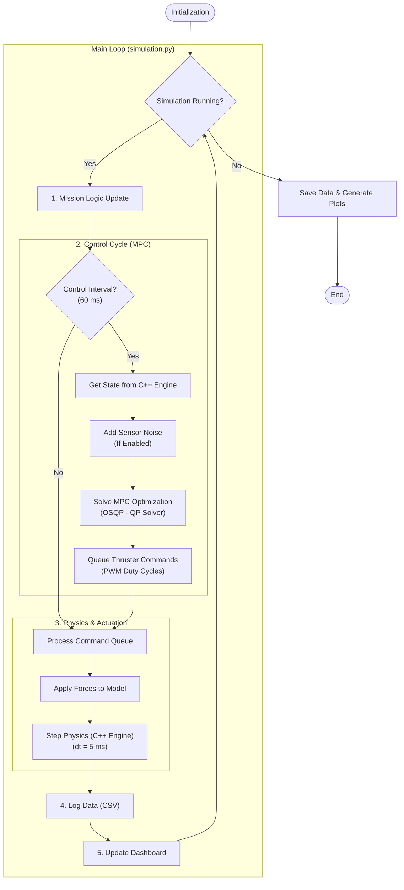

# Simulation Guide

Complete guide to running simulations, understanding mission types, and the simulation loop architecture.

---

## Table of Contents

- [Overview](#overview)
- [Mission Types](#mission-types)
- [Simulation Loop Architecture](#simulation-loop-architecture)
- [Timing & Frequency](#timing--frequency)
- [Mission Configuration](#mission-configuration)
- [Performance Characteristics](#performance-characteristics)
- [Running Simulations](#running-simulations)
- [Troubleshooting](#troubleshooting)

---

## Overview

The satellite control system supports **two primary mission types**, each with flexible configuration through an interactive CLI menu. The simulation uses a high-fidelity custom C++ physics engine with Model Predictive Control (MPC) running at different rates for optimal performance.

**Quick Start:**

```bash
python run_simulation.py
```

---

## Mission Types

### Mission 1: Waypoint Navigation

**Navigate to single or multiple waypoints in sequence**

**Features:**

- Single point-to-point navigation
- Multiple waypoint sequential navigation (up to 10 waypoints)
- Customizable position and orientation for each waypoint
- Automatic navigation with obstacle avoidance (optional)
- Configurable stabilization criteria

**Use Cases:**

- Simple point-to-point maneuvers
- Multi-stop inspection routes
- Sequential target acquisition
- Formation flying waypoint missions

**Presets Available:**

1. **Simple Translation** - Move 1m in X direction
2. **Diagonal Movement** - 45° diagonal path
3. **Rotation Test** - Pure rotation maneuver
4. **Multi-Waypoint Tour** - Sequential navigation through 4 waypoints
5. **Obstacle Course** - Navigate around obstacles
6. **Custom** - Full manual configuration

**Mission Phases:**

1. **APPROACHING** - Moving toward waypoint target
2. **STABILIZING** - Holding at waypoint (3s for intermediate, 10s for final)

---

### Mission 2: Shape Following

**Follow a moving target along predefined geometric paths**

**Available Shapes:**

1. **Circle** - Smooth circular path
2. **Rectangle** - Rectangular path with configurable dimensions
3. **Triangle** - Equilateral triangle path
4. **Hexagon** - Regular hexagon path
5. **Star** - Star-shaped path
6. **Custom DXF** - Import CAD shapes from DXF files

**Features:**

- Moving target follows the shape path at configurable speed
- Configurable shape center, rotation, and offset distance from path
- Real-time path visualization in terminal dashboard
- Adaptive velocity control based on target distance

**Use Cases:**

- Perimeter inspection patterns
- Formation flying around targets
- Orbital surveillance paths
- Custom path following from CAD designs

**Mission Phases (without return):**

1. **POSITIONING** - Moving to closest point on path
2. **PATH_STABILIZATION** - Stabilizing at start waypoint (5s)
3. **TRACKING** - Following moving target along path
4. **STABILIZING** - Holding at final path position (15s)

**Mission Phases (with return):**

1. **POSITIONING** - Moving to closest point on path
2. **PATH_STABILIZATION** - Stabilizing at start waypoint (5s)
3. **TRACKING** - Following moving target along path
4. **PATH_STABILIZATION** - Stabilizing at final waypoint (5s)
5. **RETURNING** - Moving to return position
6. **STABILIZING** - Holding at return position (15s)

### Custom DXF Shape Import

Load custom paths from CAD software:

**Supported Features:**

- Polylines and line segments
- Closed and open paths
- Automatic path conversion to waypoints
- Configurable point density along curves

**Usage:**

1. Export CAD design as DXF file (ASCII format, R12/R2000)
2. Launch: `python run_simulation.py`
3. Select "Shape Following" → "Custom DXF"
4. Provide file path
5. Configure center, rotation, offset, and speed

---

## Simulation Loop Architecture

**Key File:** `src/satellite_control/core/simulation.py`

### High-Level Control Flow



### Component Interactions

**1. Path Reference** (`mission_state.py` + `mpc_controller.py`)

MPCC derives the reference state from the configured path:

**Inputs:**

- `mission_state.mpcc_path_waypoints` - Path waypoints
- Path progress state `s` and virtual speed `v_s`

**Outputs:**

- `target_state` - Reference state aligned to path tangent
- `path_s` / `path_v_s` - Progress metrics used for logging/visualization

**2. Control Cycle (MPC)**

Runs at **16.67 Hz** (every 60ms):

**Input:**

- Current state: [x, y, z, qw, qx, qy, qz, vx, vy, vz, wx, wy, wz]
- Target state: [x_target, y_target, z_target, qw, qx, qy, qz, 0, 0, 0, 0, 0, 0]

**Computation:**

- Formulates Quadratic Program (QP) with:
  - N = 50 prediction steps (3.0 seconds ahead)
  - 13 states + 11 controls per step (3 reaction-wheel torques + 8 thrusters)
  - Cost function: minimize position/velocity/attitude error + control effort
- Solves using **OSQP** (typical: 1-2ms)

**Output:**

- 8 thruster PWM duty cycles: u ∈ [0, 1]
- Only first control action applied (receding horizon)

**3. Physics & Actuation** (`cpp_satellite.py`)

Runs at **200 Hz** (every 5ms):

**Process:**

1. **Thruster Manager** - Simulates valve delays and ramp-up (if enabled)
2. **Force Calculation** - Converts PWM to force vectors
3. **Frame Transform** - Rotates body-frame forces to world frame
4. **Apply to Physics Engine** - Applies forces/torques for the next step

**Physics Integration:**

- Computes accelerations from forces (F = ma, τ = Iα)
- Integrates to update velocities
- Integrates to update positions
- Enforces constraints (position/velocity bounds, solver limits)

**4. Data Logging** (`data_logger.py`)

**Logged Every Physics Step (200 Hz):**

- State: position, velocity, orientation
- Targets: current target state
- Mission phase

**Logged Every Control Step (16.67 Hz):**

- Thruster commands (8 duty cycles)
- MPC solve time
- MPC cost function value
- Solver status

**Output Files:**

- `physics_data.csv` - High-rate state history
- `control_data.csv` - Control inputs and MPC metrics

---

## Timing & Frequency

The simulation uses a **two-rate loop structure** for optimal performance:

### Control Loop: 16.67 Hz (60 ms period)

- **Purpose:** MPC optimization and control decisions
- **What happens:**
  - Read current state from physics engine
  - Solve QP optimization
  - Output thruster commands

### Physics Loop: 200 Hz (5 ms period)

- **Purpose:** High-fidelity dynamics integration
- **What happens:**
  - Apply thruster forces
  - Integrate equations of motion (C++ engine)
  - Update positions, velocities, orientations

### Why Two Rates?

```
Physics: |-----|-----|-----|-----|-----|-----|-----|-----|-----|-----|-----|-----| (200 Hz)
Control: |---------------------------|---------------------------| (16.67 Hz)
         ^                           ^
         MPC solve here             MPC solve here

Between MPC solves, physics continues with previous commands
```

**Benefits:**

- Physics captures fast dynamics
- Control has time to solve optimization
- Realistic representation of digital control systems

**Key Insight:** Physics runs 12 times between each MPC solve (60ms / 5ms = 12).

### Timing Configuration

All timing parameters in `src/satellite_control/config/timing.py`:

```python
CONTROL_DT = 0.06      # 16.67 Hz control loop
SIMULATION_DT = 0.005  # 200 Hz physics integration
```

**Recommendation:** Keep physics rate ≥10× control rate for stability.

---

## Mission Configuration

### InteractiveCLI

Modern menu system using `questionary` with arrow-key navigation:

```bash
python run_simulation.py
```

**Features:**

- ✓ Arrow-key navigation
- ✓ Input validation with helpful error messages
- ✓ Real-time parameter preview
- ✓ Visual mission summary before launch
- ✓ Color-coded status updates

### Command-Line Options

Quick launch without interactive menu:

```bash
# Auto mode with defaults
python run_simulation.py --auto

# Custom duration
python run_simulation.py --duration 30.0

# Headless mode (no animation)
python run_simulation.py --no-anim

# Classic text menu (legacy)
python run_simulation.py --classic
```

### Timing Parameters

**Waypoint Mission:**

- Position tolerance: 0.05m (convergence criterion)
- Velocity tolerance: 0.05 m/s (stabilization criterion)
- Angle tolerance: 3° (orientation accuracy)
- Waypoint hold time: Configurable

**Shape Following Mission:**

- Positioning phase: Approach nearest point
- Tracking phase: Variable (path_length / target_speed)
- Stabilization time: Configurable (default 10-15s)
- Return phase: Optional, variable duration

All constants modifiable in `src/satellite_control/config/timing.py`.

### Mission Safety & Constraints

**Workspace Limits:**

- Position bounds: ±3.0 meters from origin
- Max velocity: 0.5 m/s (enforced by MPC)
- Max angular velocity: π/2 rad/s ≈ 1.57 rad/s
- Simulation boundary: 6×6 meter virtual workspace

**MPC Safety Features:**

- Soft constraints on position (can violate with penalty)
- Hard constraints on velocity and angular velocity
- Automatic trajectory correction if approaching bounds
- Mission abort if constraints violated repeatedly

---

## Performance Characteristics

### Computational Load

| Component        | Frequency | Duration | % of Control Period |
| ---------------- | --------- | -------- | ------------------- |
| MPC Solve        | 16.67 Hz  | 1-2ms    | 2-3%                |
| Physics Step     | 200 Hz    | ~0.05ms  | <1%                 |
| Logging          | 200 Hz    | ~0.01ms  | <1%                 |
| Dashboard Update | 10 Hz     | ~5ms     | minimal (async)     |

**Total:** Simulation runs **faster than real-time** on modern hardware.

### Bottlenecks

1. **MPC Solver** - Dominates computation
   - Scales with horizon length (N=50)
   - Typical: 1-2ms with OSQP
2. **Visualization** - Headless or dashboard visualization
   - Rendering can slow to real-time
   - Disable with `--no-anim` for max speed

### Expected Performance

| Metric             | Target | Acceptable | Poor  |
| ------------------ | ------ | ---------- | ----- |
| MPC solve time     | <2ms   | <5ms       | >10ms |
| Position error     | <0.02m | <0.05m     | >0.1m |
| Angle error        | <2°    | <5°        | >10°  |
| Settling time (1m) | <15s   | <30s       | >45s  |

---

## Running Simulations

### Interactive Mode (Default)

```bash
python run_simulation.py
```

**Workflow:**

1. Select mission type (Waypoint or Shape Following)
2. Choose preset or custom configuration
3. Configure parameters with real-time validation
4. Preview mission summary
5. Confirm and launch

### Execution Flow Example

```
t=0.000s: MPC Solve
  ├─ Read state: x=0.0, y=0.0, θ=0.0
  ├─ Target: x=1.0, y=0.0, θ=0.0
  ├─ Solve QP in 1.2ms
  └─ Output: u = [0.0, 0.0, 0.0, 0.0, 0.82, 0.76, 0.0, 0.0]

t=0.005s - t=0.055s: Physics Steps (12 steps)

t=0.060s: MPC Solve (new state after 12 physics steps)
  ├─ Read state: x=0.012, y=0.0, θ=0.002
  ├─ Solve QP in 1.3ms
  └─ Output: u = [0.0, 0.0, 0.0, 0.0, 0.79, 0.74, 0.0, 0.0]
```

### Output Location

```
Data/
└── YYYY-MM-DD_HH-MM-SS/
    ├── physics_data.csv
    ├── control_data.csv
    └── Simulation_animation.mp4
```

---

## Troubleshooting

### Simulation Running Slower Than Real-Time

**Check:**

1. MPC solve times in `control_data.csv`
2. Disable visualization: `python run_simulation.py --no-anim`
3. Reduce horizon: Set `MPC_PREDICTION_HORIZON = 30`

### Physics Instability

**Symptoms:** Satellite position jumps, non-physical behavior

**Solutions:**

1. Reduce physics timestep: `SIMULATION_DT = 0.002` (500 Hz)
2. Check solver warnings in console
3. Verify forces are reasonable magnitude (<10N)

### Control Oscillations

**Symptoms:** Satellite oscillates around target

**Solutions:**

1. Increase velocity cost: `Q_VELOCITY = 15000`
2. Reduce control effort weight: `R_THRUST = 0.5`
3. Check MPC solve status for failures

### Configuration

Change loop rates in `src/satellite_control/config/timing.py`:

```python
CONTROL_DT = 0.06      # Control frequency
SIMULATION_DT = 0.005  # Physics frequency
```

---

## Summary

The simulation provides:

✅ **Accurate physics** with high-rate (200 Hz) integration  
✅ **Realistic control** with discrete-time (16.67 Hz) MPC  
✅ **Efficient computation** by separating control and physics rates  
✅ **Comprehensive logging** for post-analysis  
✅ **Real-time visualization** via terminal dashboard  
✅ **Flexible missions** with waypoint and shape following modes

This design mirrors real embedded control systems where controllers run at lower rates than sensor/actuator updates.

**Next Steps:**

- See [QUICKSTART.md](QUICKSTART.md) for getting started
- See [TESTING.md](TESTING.md) for validation and testing
- See [VISUALIZATION.md](VISUALIZATION.md) for understanding output
